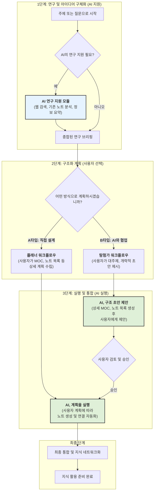

## 1. 새로운 지식 관리 철학: 연구 → 구조화 → 실행

이 가이드는 단일 정보(지식 덩어리)를 처리하는 것을 넘어, **주제에 대한 깊이 있는 탐구부터 최종적인 지식 네트워크 구축까지** 전 과정을 지원하는 유연하고 강력한 워크플로우를 제안합니다. 목표는 사용자의 의도에 따라 AI의 지원 수준을 조절하며, 창의적이고 체계적인 지식 관리를 실현하는 것입니다.

모든 프로세스의 기본 규칙은 **`[[00. AI Obsidian Core Rules.md]]`** 문서를 절대적으로 따릅니다.

---

## 2. 3단계 지식 구조화 워크플로우

새로운 워크플로우는 **연구(Research) → 구조화(Structure) → 실행(Execute)** 의 3단계로 구성됩니다. 각 단계는 사용자의 필요에 따라 독립적으로 또는 연속적으로 활용될 수 있습니다.

### 1단계: 연구 및 아이디어 구체화 (AI 지원)

- **목표**: 본격적인 노트 작성에 앞서, 주제에 대한 충분한 정보를 수집하고 아이디어를 구체화합니다. 막연한 질문이나 키워드로 시작할 수 있습니다.
- **AI의 역할**: 웹 검색, 기존 노트 분석, 정보 요약 등을 통해 사용자의 초기 연구를 돕는 '연구 조력자' 역할을 수행합니다.
- **상세 가이드**: **`[[Task1_AI_Assisted_Research.md]]`**

### 2단계: 구조화 계획 (사용자 선택)

- **목표**: 수집된 정보를 바탕으로 MOC(Map of Content)를 중심으로 지식을 어떻게 조직할지 계획합니다. 이 단계에서 사용자는 자신의 선호에 따라 작업 방식을 선택할 수 있습니다.
- **AI의 역할**: 사용자의 선택에 따라 '계획 실행자' 또는 '구조 제안자'의 역할을 맡습니다.
- **상세 가이드**: **`[[Task2_Structuring_Workflows.md]]`** 에서 아래 두 가지 워크플로우를 자세히 설명합니다.
    - **A타입 (Planner):** 사용자가 MOC와 하위 노트 목록까지 상세하게 직접 설계하는 방식입니다.
    - **B타입 (Explorer):** 사용자가 큰 주제와 대략적인 방향만 제시하면, AI가 구체적인 구조 초안을 제안하는 협업 방식입니다.

### 3단계: 실행 및 통합 (AI 실행)

- **목표**: 2단계에서 수립된 계획에 따라 실제 노트들을 생성, 수정, 연결하여 완전한 지식 네트워크를 구축합니다.
- **AI의 역할**: 노트 생성, Frontmatter 작성, MOC 업데이트, 노트 간 상호 링크 설정 등 반복적이고 시간이 많이 소요되는 작업을 자동화하여 사용자가 내용에만 집중할 수 있도록 지원합니다.

---

## 3. 핵심 원칙

1.  **사용자 중심**: 모든 과정의 최종 의사결정권자는 사용자입니다. AI는 강력한 조력자일 뿐입니다.
2.  **유연성**: 사용자는 언제든 자신의 필요에 맞춰 A타입과 B타입 워크플로우를 선택하거나, 특정 단계만 독립적으로 사용할 수 있습니다.
3.  **모듈성**: 각 단계별 상세 가이드를 통해 복잡성을 낮추고, 필요할 때 원하는 정보에 쉽게 접근할 수 있도록 지원합니다.
