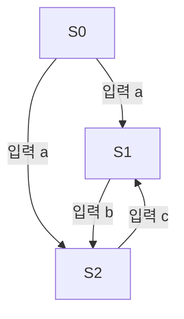

---
tags:
  - 유한오토마타
aliases: null
title: DFA와 NFA 차이점
created: 2024-12-06T00:00:00.000Z
---
작성 날짜: 2024-12-06
작성 시간: 16:02

----
## 내용(Content)

### DFA & NFA 비교 및  분석

[[Finite State Machine|유한 상태 기계(Finite State Machine, FSM)]]는 상태 기반의 시스템을 모델링하는 중요한 수학적 모델로, 복잡한 소프트웨어 엔지니어링 문제를 해결하는 데 필수적인 역할을 한다. 특히 FSM의 두 주요 유형인 **Deterministic Finite Automaton (DFA)**와 **Nondeterministic Finite Automaton (NFA)** 는 이론적 배경뿐만 아니라 실무에서도 자주 사용되며, 다양한 컴퓨터 과학 문제의 해결을 위한 기초적인 수단을 제공한다. 본 글에서는 DFA와 NFA의 이론적 차이와 이들 각각의 특징에 대해서 이야기 하고자 한다.

### DFA와 NFA의 개념

**Deterministic Finite Automaton (DFA)**는 특정 상태에서 특정 입력을 받았을 때 항상 단 하나의 상태로 전이되는  `결정적` 모델이다.  모든 입력에 대해 다음 상태가 명확하게 정의되며, 상태 전이의 경로가 유일하다는 점에서 직관적이다. DFA는 복잡하지 않은 시스템이나 상태 전이가 명확하게 구분되는 시스템을 모델링하는 데 자주 사용된다. 예를 들어, 자동판매기처럼 각 단계에서 특정 입력에 대해 유일한 결과가 나오는 시스템을 생각해볼 수 있다. 사용자가 일정한 금액을 넣으면 정해진 제품이 나오는 방식이 DFA의 동작 방식과 유사하다.

반면 **Nondeterministic Finite Automaton (NFA)**는 특정 상태에서 하나의 입력이 들어왔을 때 여러 개의 상태로 전이될 수 있는 `비결정적` 모델이다. 즉, 하나의 입력에 대해 여러 가능한 다음 상태가 존재할 수 있으며, 시스템은 여러 경로를 동시에 탐색하는 것처럼 표현될 수 있다. 이러한 특성은 NFA를 복잡한 문제를 간단하게 표현할 수 있는 유연한 구조로 만들어 준다. 예를 들어, 미로 탐색 문제에서 여러 갈림길을 동시에 시도하는 방식은 NFA의 비결정적 특성을 잘 보여준다.

간단한 예시로, 다음과 같은 상태 전이 다이어그램을 고려해 봅시다:

이 다이어그램에서, 상태 S0에서 입력 'a'가 들어오면 S1 또는 S2로 전이될 수 있습니다. 이러한 다중 경로의 가능성은 NFA의 비결정성을 시각적으로 잘 보여준다.

### DFA와 NFA의 주요 차이점

두 모델의 가장 큰 차이점은 **상태 전이 방식**입니다. DFA는 특정 입력에 대해 항상 하나의 상태로만 전이하는 반면, NFA는 같은 입력으로 여러 상태로 전이할 수 있습니다. 이를 더 명확히 이해하기 위해 DFA와 NFA의 차이점을 표로 정리해 보겠다.

| 특징    | DFA (Deterministic Finite Automaton) | NFA (Nondeterministic Finite Automaton) |
| ----- | ------------------------------------ | --------------------------------------- |
| 상태 전이 | 각 입력에 대해 하나의 상태로 전이                  | 각 입력에 대해 여러 상태로 전이 가능                   |
| 복잡성   | 구현이 단순하고 명확함                         | 구현이 더 유연하지만 복잡할 수 있음                    |
| 상태 수  | 일반적으로 더 많은 상태를 필요로 함                 | 상태 수가 상대적으로 적을 수 있음                     |
| 실행 속도 | 보통 빠름                                | 느릴 수 있음 (동시에 여러 경로 탐색)                  |
| 직관성   | 전이가 명확하게 정의됨                         | 전이가 모호할 수 있음                            |

위 표에서 볼 수 있듯이, DFA는 명확한 상태 전이와 예측 가능한 실행 속도를 제공하며, 시스템의 안정성과 효율성 면에서 장점이 있다. 반면, NFA는 복잡한 상태 전이를 보다 간결하고 유연하게 표현할 수 있지만, 실행 과정에서의 비효율성과 직관성 부족이 단점으로 작용할 수 있다. 이러한 특성 때문에 DFA는 단순하고 예측 가능한 시스템에, NFA는 복잡하고 유연한 시스템에 적합하다.

### DFA와 NFA의 관계

모든 NFA는 이론적으로 DFA로 변환이 가능하다. 즉, NFA가 수용할 수 있는 언어는 DFA로도 수용할 수 있다. 이 변환 과정에서 상태 수가 지수적으로 증가할 수 있지만, 결과적으로 DFA와 NFA는 동일한 표현력을 가집니다. 이러한 변환의 과정은 이론적으로 중요하며, 이는 정규 언어와 오토마타 이론의 기초가 된다.

예를 들어, 정규 표현식 처리에서 NFA는 패턴 매칭을 수행하는 데 적합하며, 이를 DFA로 최적화하면 보다 빠르게 실행할 수 있다. 실제로 대부분의 정규 표현식 엔진은 NFA를 기반으로 패턴을 일치시키고, 성능을 향상시키기 위해 DFA로의 변환을 사용한다.

### DFA와 NFA의 장단점

![[napkin-selection.png|400]]

- **DFA의 장점**:
	- 모든 입력에 대해 전이가 명확하므로, 상태 추적과 예측이 용이하다.
	- 전이 경로가 유일하기 때문에 실행 시간이 일정하고 효율적이다.
- **DFA의 단점**:
	- 복잡한 시스템을 표현할 때 많은 상태가 필요할 수 있어 상태 폭발 문제가 발생할 수 있다.
	- 상태 수가 많아질 경우 구현이 복잡해질 수 있다.
- **NFA의 장점**:
	- 복잡한 상태 전이를 간결하게 표현할 수 있으며, 설계가 직관적이다.
	- 특정 문제에 대해 더 유연하게 접근할 수 있으며, 표현의 간결성이 유지된다.
- **NFA의 단점**:
	- 여러 경로를 동시에 탐색해야 하므로 실제 실행 시 비효율적일 수 있다.
	- 전이의 비결정성 때문에 디버깅이 어려울 수 있다.

### DFA와 NFA의 실무적 활용

실무에서 DFA와 NFA는 모두 활용됩니다. DFA는 상태 관리가 명확하게 필요하고, 시스템의 안정성이 중요한 경우에 사용된다. 예를 들어, 통신 프로토콜의 상태 관리나 보안 인증 시스템에서 DFA는 명확한 상태 전이가 필요하다. 반면, NFA는 정규 표현식 처리나 복잡한 탐색 알고리즘에서 사용됩니다. 정규 표현식의 경우 여러 경로를 동시에 고려해야 하므로 NFA의 비결정적 특성이 적합하다.

컴파일러 설계에서도 DFA와 NFA는 중요한 역할을 한다. 정규 언어를 분석할 때, 먼저 NFA로 표현한 후 이를 DFA로 변환하여 최적화된 상태 머신을 만드는 방식으로 사용된다. 이 과정은 언어 처리기의 성능과 정확성을 높이는 데 매우 중요하다.

## 질문 & 확장

### 결론

DFA와 NFA는 유한 상태 기계의 두 가지 중요한 유형으로, 각각 고유한 장단점을 가지고 있다. DFA는 명확한 상태 전이를 통해 안정적이고 예측 가능한 모델링에 적합하고, NFA는 복잡한 전이를 간결하게 표현하는 데 유리하다. 두 모델은 이론적으로 동일한 표현력을 가지지만, 실제 구현 방식과 사용 목적에 따라 적합한 모델이 달라질 수 있다. DFA는 명확성과 예측 가능성이 필요한 시스템에 적합하고, NFA는 복잡하고 유연한 상황을 다루는 데 유리하다. 이러한 이해는 정규 언어와 오토마타 이론, 그리고 컴파일러 설계 등 다양한 분야에서 중요한 기초가 된다.

## 출처(링크)

- [[Difference between DFA and NFA - GeeksforGeeks.pdf]]
- [[lec4.pdf]]
- [정규식 동작 - .NET | Microsoft Learn](https://learn.microsoft.com/ko-kr/dotnet/standard/base-types/details-of-regular-expression-behavior?redirectedfrom=MSDN)

## 연결 노트

