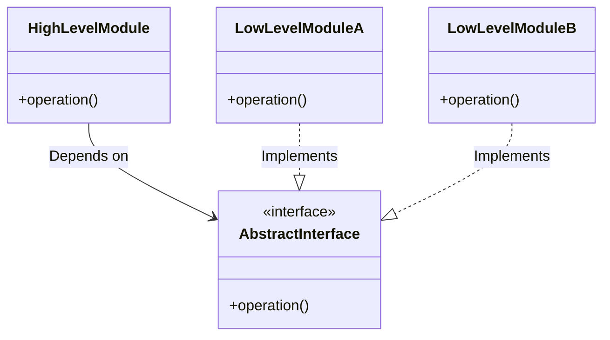

---
tags:
  - 객체지향
aliases:
  - SOLID
title: SOLID란 무엇인가
created: 2023-10-03T00:00:00.000Z
---

작성 날짜: 2023-10-03
작성 시간: 07:04

----
## 내용

### 주제 요약

**SOLID 원칙**은 객체 지향 설계에서 코드를 이해하고 유지보수하기 쉽게 만드는 다섯 가지 핵심 원칙의 집합이다[^1]. 이 원칙은 시스템의 유연성과 재사용성을 높이고, 기능 추가나 코드 변경 시에도 최소한의 수정으로 대응할 수 있는 설계를 목표로 한다.

### SOLID 원칙의 주요 구성

#### 1. 단일 책임 원칙 (Single Responsibility Principle, SRP)

- **설명**: 클래스는 하나의 책임만 가져야 하며, 이를 변경할 이유도 하나여야 한다[^2].
- **예**: 사용자 데이터를 처리하는 클래스는 데이터 저장과 UI 처리를 모두 담당해서는 안 된다. 대신, 데이터를 처리하는 클래스와 UI 관련 클래스를 분리해야 한다.

#### 2. 개방-폐쇄 원칙 (Open-Closed Principle, OCP)

- **설명**: 소프트웨어는 확장에는 열려 있어야 하지만, 수정에는 닫혀 있어야 한다[^3].
- **예**: 새로운 기능을 추가할 때 기존 코드를 변경하지 않고, 새로운 클래스를 작성해 기존 시스템에 추가한다.

#### 3. 리스코프 치환 원칙 (Liskov Substitution Principle, LSP)

- **설명**: 서브 클래스는 언제나 부모 클래스를 대체할 수 있어야 한다[^4].
- **예**: 상속 관계에서 자식 클래스가 부모 클래스의 행위를 깨뜨리지 않도록 구현해야 한다. 예를 들어, `Rectangle` 클래스의 서브클래스인 `Square`가 `setWidth()`와 `setHeight()` 메서드의 원래 의도를 해치지 않도록 설계한다.

### 4. 인터페이스 분리 원칙 (Interface Segregation Principle, ISP)

- **설명**: 클라이언트는 자신이 사용하지 않는 메서드에 의존하지 않아야 한다[^5].
- **예**: 거대한 인터페이스 대신 여러 개의 작은 인터페이스로 나누어 특정 클래스가 필요한 기능만 구현하도록 설계한다.

### 5. 의존 역전 원칙 (Dependency Inversion Principle, DIP)

- **설명**: 고수준 모듈은 저수준 모듈에 의존하지 말아야 하며, 둘 다 추상화된 것에 의존해야 한다[^6].
- **예**: 특정 데이터베이스 구현에 직접 의존하지 않고, `Repository` 인터페이스를 통해 데이터베이스와 상호작용하면 다양한 데이터베이스로 쉽게 교체할 수 있다.  

 **DIP 원칙이 적용된 클래스 다이어그램.**

### SOLID 원칙 요약 표

|두문자|약어|개념|설명|
|---|---|---|---|
|S|SRP|단일 책임 원칙(Single Responsibility Principle)|클래스는 단 하나의 책임만 가져야 하며, 변경 이유가 하나여야 한다.|
|O|OCP|개방 폐쇄 원칙(Open Closed Principle)|소프트웨어 엔티티는 확장에 열려 있어야 하며, 변경에는 닫혀 있어야 한다.|
|L|LSP|리스코프 치환 법칙(Liskov Substitution Principle)|자식 클래스는 언제나 부모 클래스를 대체할 수 있어야 한다.|
|I|ISP|인터페이스 분리 원칙(Interface Segregation Principle)|인터페이스는 구체적인 클라이언트에 맞게 분리되어야 하며, 불필요한 의존성을 줄여야 한다.|
|D|DIP|의존 관계 역전 원칙(Dependency Inversion Principle)|고수준 모듈은 저수준 모듈에 의존해서는 안 되며, 추상화에 의존해야 한다.|

## 질문 & 확장

1. SOLID 원칙을 실제 프로젝트에서 어떻게 적용할 수 있는가?  
2. SOLID 원칙을 지키지 않으면 발생할 수 있는 문제는 무엇인가?  
3. SOLID 외에도 소프트웨어 설계에서 중요한 원칙이나 패턴은 무엇이 있는가?

## 연결 노트

- [[Single Responsibility Principal]]
- [[Open Closed Principle]]
- [[리스코프 치환 원칙(Liskov Substitution Principle)]]
- related:: [[결합도]]
- related:: [[응집도]]

## 출처

[^1]: Robert C. Martin, *Agile Software Development, Principles, Patterns, and Practices*, Pearson, 2002.  

    > "The SOLID principles are the foundation for creating understandable and maintainable software."  

    SOLID 원칙의 기본 개념을 명확히 설명하기 위해 참조.

[^2]: Ibid., Chapter 5.  

    > "A class should have only one reason to change."  

    단일 책임 원칙의 정의와 예제를 설명하기 위해 활용.

[^3]: Bertrand Meyer, *Object-Oriented Software Construction*, Prentice Hall, 2nd Edition, Chapter 23.  

    > "Modules should be open to extension but closed to modification."  

    개방-폐쇄 원칙의 기초 이론을 설명하기 위해 인용.

[^4]: Barbara Liskov, "Data Abstraction and Hierarchy," OOPSLA 1987.  

    > "Derived classes must be substitutable for their base classes without affecting program correctness."  

    리스코프 치환 원칙의 정의를 명확히 하기 위해 참조.

[^5]: Robert C. Martin, *Clean Architecture*, Pearson, 2017.  

    > "The Interface Segregation Principle advocates for multiple small, client-specific interfaces."  

    인터페이스 분리 원칙의 실용적 접근법을 설명하기 위해 인용.

[^6]: Ibid., Chapter 8.  

    > "High-level modules should not depend on low-level modules."  

    의존 역전 원칙을 설명하고, 이를 통해 설계 유연성을 보장하는 이유를 강조.  

