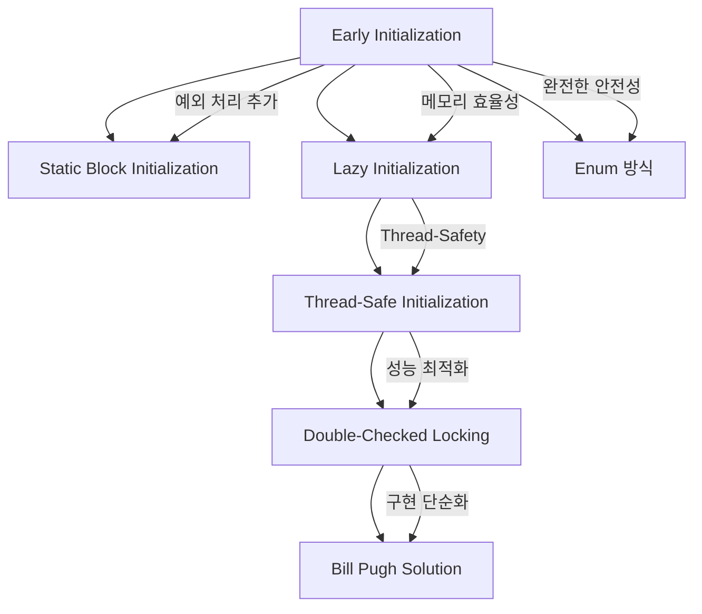

---
tags:
  - 객체지향
  - 디자인패턴
  - JAVA
  - GoF
  - 구현
  - 싱글톤
aliases:
  - Singleton Implementation Methods
  - 싱글톤 구현 방법
created: 2025-06-05
title: 싱글톤 패턴 구현 방법
note-type: COMMON
completed: true
---

## 내용(Content)

### 구현 개요

싱글톤 패턴은 시간이 지나면서 다양한 문제점들이 발견되고 해결되면서 여러 구현 방법이 발전해왔습니다. 각 구현 방법은 Thread-Safety, 성능, 메모리 효율성 등의 측면에서 서로 다른 특징을 가지고 있습니다.

>[!summary]
>싱글톤 패턴의 7가지 구현 방법과 그 진화 과정, 각 방법의 특징과 선택 기준
### 구현 방법 진화 과정



### 1. Early Initialization (즉시 초기화)

클래스 로딩 시점에 즉시 인스턴스를 생성하는 가장 간단한 방법입니다.

```java
public class EarlySingleton {
    private static final EarlySingleton INSTANCE = new EarlySingleton();
    
    private EarlySingleton() {}
    
    public static EarlySingleton getInstance() {
        return INSTANCE;
    }
}
```

**특징:**
- **Thread-Safe**: ✅ (클래스 로더가 동기화 처리)
- **지연 초기화**: ❌ (클래스 로딩 시점에 생성)
- **성능**: ⭐⭐⭐ (동기화 오버헤드 없음)
- **구현 복잡도**: ⭐ (매우 간단)

**장점:**
- 구현이 매우 간단하고 명확함
- Thread-safe 보장
- 성능이 우수함

**단점:**
- 사용하지 않아도 인스턴스가 생성되어 메모리 낭비 가능
- 인스턴스 생성 시 예외 처리 어려움

**사용 시나리오:** 인스턴스가 반드시 사용되고, 생성 비용이 크지 않은 경우

### 2. Static Block Initialization

Static 블록을 사용하여 예외 처리를 추가한 방법입니다.

```java
public class StaticBlockSingleton {
    private static StaticBlockSingleton instance;
    
    static {
        try {
            instance = new StaticBlockSingleton();
        } catch (Exception e) {
            throw new RuntimeException("싱글톤 인스턴스 생성 실패", e);
        }
    }
    
    private StaticBlockSingleton() {}
    
    public static StaticBlockSingleton getInstance() {
        return instance;
    }
}
```

**특징:**
- **Thread-Safe**: ✅
- **지연 초기화**: ❌
- **성능**: ⭐⭐⭐
- **구현 복잡도**: ⭐⭐

**장점:**
- Early Initialization의 장점 유지
- 예외 처리 가능

**단점:**
- 여전히 지연 초기화 불가능
- 메모리 낭비 문제 지속

**사용 시나리오:** 인스턴스 생성 시 복잡한 초기화나 예외 처리가 필요한 경우

### 3. Lazy Initialization (지연 초기화)

필요한 시점에 인스턴스를 생성하는 방법입니다.

```java
public class LazySingleton {
    private static LazySingleton instance;
    
    private LazySingleton() {}
    
    public static LazySingleton getInstance() {
        if (instance == null) {
            instance = new LazySingleton();
        }
        return instance;
    }
}
```

**특징:**
- **Thread-Safe**: ❌ (멀티스레드 환경에서 문제)
- **지연 초기화**: ✅
- **성능**: ⭐⭐⭐
- **구현 복잡도**: ⭐

>[!warning] Thread-Safety 문제
>여러 스레드가 동시에 접근하면 여러 인스턴스가 생성될 수 있다. 멀티스레드 환경에서는 사용 X.

**장점:**
- 메모리 효율적 (필요할 때만 생성)
- 지연 초기화 지원

**단점:**
- Thread-safe하지 않음
- 여러 스레드가 동시에 접근하면 여러 인스턴스 생성 가능

**사용 시나리오:** 단일 스레드 환경에서만 사용 권장

### 4. Thread-Safe Initialization

synchronized 키워드를 사용하여 스레드 안전성을 보장하는 방법입니다.

```java
public class ThreadSafeSingleton {
    private static ThreadSafeSingleton instance;
    
    private ThreadSafeSingleton() {}
    
    public static synchronized ThreadSafeSingleton getInstance() {
        if (instance == null) {
            instance = new ThreadSafeSingleton();
        }
        return instance;
    }
}
```

**특징:**
- **Thread-Safe**: ✅
- **지연 초기화**: ✅
- **성능**: ⭐ (동기화 오버헤드)
- **구현 복잡도**: ⭐⭐

**장점:**
- Thread-safe 보장
- 지연 초기화 지원

**단점:**
- 성능 저하 (매번 동기화 오버헤드)
- 인스턴스 생성 후에도 불필요한 동기화 발생

**사용 시나리오:** Thread-safety가 중요하지만 성능이 크게 중요하지 않은 경우

### 5. Double-Checked Locking

동기화 성능 문제를 해결하기 위한 최적화된 방법입니다.

```java
public class DoubleCheckedSingleton {
    private static volatile DoubleCheckedSingleton instance;
    
    private DoubleCheckedSingleton() {}
    
    public static DoubleCheckedSingleton getInstance() {
        if (instance == null) {
            synchronized (DoubleCheckedSingleton.class) {
                if (instance == null) {
                    instance = new DoubleCheckedSingleton();
                }
            }
        }
        return instance;
    }
}
```

**특징:**
- **Thread-Safe**: ✅
- **지연 초기화**: ✅
- **성능**: ⭐⭐ (최적화됨)
- **구현 복잡도**: ⭐⭐⭐

>[!info] volatile 키워드 필수
>메모리 가시성 문제를 해결하기 위해 `volatile` 키워드가 반드시 필요하다. 자세한 내용은 [[싱글톤 패턴 Thread-Safety]] 참조.

**장점:**
- Thread-safe 보장
- 성능 최적화 (인스턴스 생성 후 동기화 불필요)
- 지연 초기화 지원

**단점:**
- 구현 복잡성 증가
- volatile 키워드 필수
- JVM 최적화에 의한 미묘한 버그 가능성

**사용 시나리오:** 성능과 Thread-safety를 모두 고려해야 하는 경우

**상세 구현:** [[06. Code Notes/Area/Java/⌨️ 싱글톤 Double-Checked Locking_java (2025-06-05)|⌨️ 싱글톤 Double-Checked Locking_java (2025-06-05)]]

### 6. Bill Pugh Solution (권장)

Static 내부 클래스를 활용한 우아한 해결책입니다.

```java
public class BillPughSingleton {
    private BillPughSingleton() {}
    
    private static class SingletonHelper {
        private static final BillPughSingleton INSTANCE = new BillPughSingleton();
    }
    
    public static BillPughSingleton getInstance() {
        return SingletonHelper.INSTANCE;
    }
}
```

**특징:**
- **Thread-Safe**: ✅ (클래스 로더 메커니즘 활용)
- **지연 초기화**: ✅ (내부 클래스는 사용 시점에 로딩)
- **성능**: ⭐⭐⭐ (동기화 오버헤드 없음)
- **구현 복잡도**: ⭐⭐

>[!tip] 가장 권장되는 방법
>대부분의 상황에서 최적의 선택입니다. Thread-safe하면서도 지연 초기화를 지원하고 성능도 우수하다.

**장점:**
- Thread-safe 보장
- 지연 초기화 지원
- 성능 우수
- 구현 간단

**단점:**
- 리플렉션 공격에 취약

**사용 시나리오:** 가장 권장되는 방법 - 대부분의 상황에서 최적

**상세 구현:** [[06. Code Notes/Area/Java/⌨️ 싱글톤 Bill Pugh Solution_java (2025-06-05)|⌨️ 싱글톤 Bill Pugh Solution_java (2025-06-05)]]

### 7. Enum 방식 (권장)

Enum의 특성을 활용한 가장 안전한 구현 방법이다.

```java
public enum EnumSingleton {
    INSTANCE;
    
    public void doSomething() {
        // 비즈니스 로직
    }
}

// 사용법
EnumSingleton.INSTANCE.doSomething();
```

**특징:**
- **Thread-Safe**: ✅
- **지연 초기화**: ❌
- **성능**: ⭐⭐⭐
- **구현 복잡도**: ⭐ (매우 간단)

>[!tip] 가장 안전한 방법
>리플렉션 공격과 직렬화 문제를 완전히 방지하는 가장 안전한 구현 방법이다.

**장점:**
- Thread-safe 보장
- 직렬화 안전성 보장
- 리플렉션 공격 방지
- 구현 매우 간단

**단점:**
- 지연 초기화 불가능
- 상속 불가능 (Enum은 다른 클래스 상속 불가)

**사용 시나리오:** 가장 안전한 방법 - 보안이 중요한 환경에서 권장

**상세 구현:** [[⌨️ 싱글톤 Enum 방식_java]]

### 구현 방법 비교표

| 구현 방법 | Thread-Safe | 지연 초기화 | 성능 | 구현 복잡도 | 권장도 |
|-----------|-------------|-------------|------|-------------|--------|
| Early Initialization | ✅ | ❌ | ⭐⭐⭐ | ⭐ | ⭐⭐ |
| Static Block | ✅ | ❌ | ⭐⭐⭐ | ⭐⭐ | ⭐⭐ |
| Lazy Initialization | ❌ | ✅ | ⭐⭐⭐ | ⭐ | ❌ |
| Thread-Safe | ✅ | ✅ | ⭐ | ⭐⭐ | ⭐ |
| Double-Checked | ✅ | ✅ | ⭐⭐ | ⭐⭐⭐ | ⭐⭐ |
| **Bill Pugh** | ✅ | ✅ | ⭐⭐⭐ | ⭐⭐ | **⭐⭐⭐** |
| **Enum** | ✅ | ❌ | ⭐⭐⭐ | ⭐ | **⭐⭐⭐** |

### 선택 기준

#### 상황별 최적 선택

1. **일반적인 애플리케이션**: **Bill Pugh Solution**
   - Thread-safe, 지연 초기화, 높은 성능
   - 구현 간단, 유지보수 용이

2. **보안이 중요한 환경**: **Enum 방식**
   - 리플렉션 공격 방지
   - 직렬화 안전성 보장

3. **레거시 시스템**: **Early Initialization**
   - 단순하고 안정적
   - 메모리 사용량이 크지 않은 경우

4. **고성능이 필요한 경우**: **Double-Checked Locking**
   - 세밀한 성능 튜닝 가능
   - volatile 키워드 필수 주의

>[!warning] 피해야 할 패턴
>**Lazy Initialization**은 멀티스레드 환경에서 절대 사용하지 마세요. 여러 인스턴스가 생성될 수 있습니다.

## 질문 & 확장

### 심화 학습 질문

1. **클래스 로더**: Bill Pugh Solution에서 내부 클래스가 언제 로딩되는가?
2. **JVM 최적화**: Double-Checked Locking에서 volatile이 없으면 어떤 문제가 발생하는가?
3. **직렬화**: Enum 방식이 직렬화에서 안전한 이유는 무엇인가?

### 다음 단계 학습

- [[싱글톤 패턴 Thread-Safety]] - 멀티스레드 환경의 동시성 이슈 심화 분석
- [[⌨️ 싱글톤 Bill Pugh Solution_java]] - 권장 구현 방법의 상세 코드
- [[⌨️ 싱글톤 Enum 방식_java]] - 가장 안전한 구현 방법의 상세 코드

## 출처

- Joshua Bloch. "Effective Java" 3rd Edition (2017) - Item 3
- Brian Goetz. "Java Concurrency in Practice" (2006)

## 연결 노트

### 상위 개념
- [[🏛️ 싱글톤 패턴]] - 전체 싱글톤 패턴 MOC
- [[싱글톤 패턴 기본 개념]] - 기본 개념과 원리

### 관련 개념
- [[싱글톤 패턴 Thread-Safety]] - Thread-Safety 이슈 심화 분석

---

**마지막 업데이트**: 2025-01-16  
**작성자**: AI Assistant  
**검토 상태**: 완료 