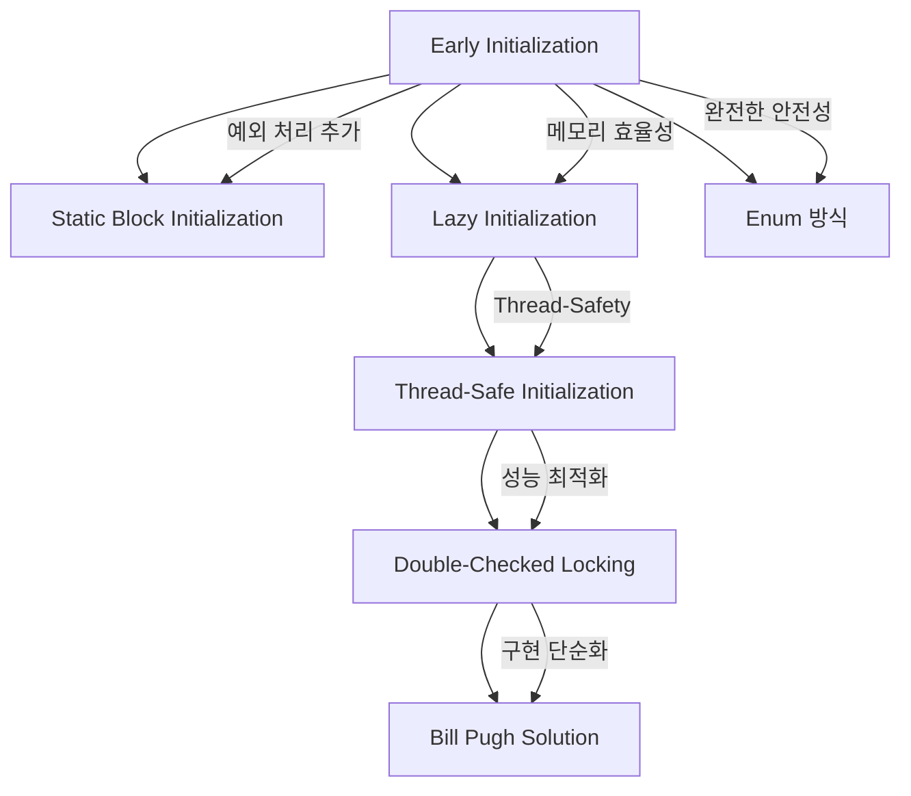

---
tags:
  - 객체지향
  - 디자인패턴
  - JAVA
  - GoF
aliases:
  - Singleton Pattern
  - 싱글턴
title: 싱글톤 패턴
created: 2025-01-16T00:00:00.000Z
note-type: COMMON
completed: true
---

작성 날짜: 2025-01-16
작성 시간: 10:50

----

## 내용(Content)

### 주제 요약

>[!summary]
>클래스의 인스턴스가 오직 하나만 생성되도록 보장하는 GoF 생성 패턴

**싱글톤 패턴(Singleton Pattern)**은 GoF(Gang of Four) 디자인 패턴 중 생성 패턴의 하나로, 특정 클래스의 인스턴스가 프로그램 전체에서 단 하나만 존재하도록 보장하는 패턴이다. 이 패턴은 전역 접근점을 제공하면서도 인스턴스 생성을 엄격히 제어하여 메모리 효율성과 일관성을 보장한다.

### 싱글톤 패턴의 정의와 목적

싱글톤 패턴은 다음과 같은 두 가지 핵심 목적을 가진다:

1. **인스턴스 생성 제어**: 클래스의 인스턴스가 오직 하나만 생성되도록 보장
2. **전역 접근점 제공**: 해당 인스턴스에 대한 전역적인 접근 방법 제공

이는 데이터베이스 연결, 로깅 시스템, 설정 관리 등과 같이 시스템 전체에서 하나의 인스턴스만 필요한 경우에 유용하다.

### GoF 생성 패턴으로서의 특징

싱글톤 패턴은 GoF의 5가지 생성 패턴 중 하나로, 다음과 같은 특징을 가진다:

- **객체 생성 캡슐화**: 인스턴스 생성 로직을 클래스 내부에 캡슐화
- **생성 시점 제어**: 필요한 시점에 인스턴스를 생성하는 지연 초기화 지원
- **메모리 효율성**: 불필요한 객체 생성을 방지하여 메모리 사용량 최적화

### 기본 구현 원리

싱글톤 패턴의 기본 구현은 다음 세 가지 요소로 구성된다:

1. **Private 생성자**: 외부에서 직접 인스턴스를 생성하지 못하도록 제한
2. **Static 인스턴스 변수**: 클래스 레벨에서 유일한 인스턴스를 저장
3. **Static 접근 메서드**: 인스턴스에 접근할 수 있는 전역 접근점 제공

```java
public class BasicSingleton {
    private static BasicSingleton instance;
    
    // Private 생성자로 외부 인스턴스 생성 방지
    private BasicSingleton() {}
    
    // 전역 접근점 제공
    public static BasicSingleton getInstance() {
        if (instance == null) {
            instance = new BasicSingleton();
        }
        return instance;
    }
}
```

### 핵심 특징 요약

| 특징 | 설명 | 이점 |
|------|------|------|
| **인스턴스 유일성** | 클래스당 하나의 인스턴스만 존재 | 메모리 효율성, 상태 일관성 |
| **전역 접근** | 어디서든 동일한 인스턴스에 접근 가능 | 편의성, 데이터 공유 |
| **지연 초기화** | 필요한 시점에 인스턴스 생성 | 성능 최적화, 리소스 절약 |
| **생성 제어** | 인스턴스 생성 시점과 방법을 제어 | 초기화 로직 캡슐화 |

## 싱글톤 패턴 구현 방법 상세 분석

싱글톤 패턴은 시간이 지나면서 다양한 문제점들이 발견되고 해결되면서 여러 구현 방법이 발전해왔다. 다음은 주요한 6가지 구현 방법과 그 진화 과정이다.

### 1. Early Initialization (즉시 초기화)

클래스 로딩 시점에 즉시 인스턴스를 생성하는 가장 간단한 방법이다.

```java
public class EarlySingleton {
    // 클래스 로딩 시점에 인스턴스 생성
    private static final EarlySingleton INSTANCE = new EarlySingleton();
    
    private EarlySingleton() {}
    
    public static EarlySingleton getInstance() {
        return INSTANCE;
    }
}
```

**장점:**
- 구현이 매우 간단하고 명확함
- Thread-safe 보장 (클래스 로더가 동기화 처리)
- 성능이 우수함 (동기화 오버헤드 없음)

**단점:**
- 사용하지 않아도 인스턴스가 생성되어 메모리 낭비 가능
- 인스턴스 생성 시 예외 처리 어려움
- 지연 초기화 불가능

**사용 시나리오:** 인스턴스가 반드시 사용되고, 생성 비용이 크지 않은 경우

### 2. Static Block Initialization

Static 블록을 사용하여 예외 처리를 추가한 방법이다.

```java
public class StaticBlockSingleton {
    private static StaticBlockSingleton instance;
    
    static {
        try {
            instance = new StaticBlockSingleton();
        } catch (Exception e) {
            throw new RuntimeException("싱글톤 인스턴스 생성 실패", e);
        }
    }
    
    private StaticBlockSingleton() {}
    
    public static StaticBlockSingleton getInstance() {
        return instance;
    }
}
```

**장점:**
- Early Initialization의 장점 유지
- 예외 처리 가능
- Thread-safe 보장

**단점:**
- 여전히 지연 초기화 불가능
- 메모리 낭비 문제 지속

**사용 시나리오:** 인스턴스 생성 시 복잡한 초기화나 예외 처리가 필요한 경우

### 3. Lazy Initialization (지연 초기화)

필요한 시점에 인스턴스를 생성하는 방법이다.

```java
public class LazySingleton {
    private static LazySingleton instance;
    
    private LazySingleton() {}
    
    public static LazySingleton getInstance() {
        if (instance == null) {
            instance = new LazySingleton();
        }
        return instance;
    }
}
```

**장점:**
- 메모리 효율적 (필요할 때만 생성)
- 지연 초기화 지원

**단점:**
- **Thread-safe하지 않음** (멀티스레드 환경에서 문제)
- 여러 스레드가 동시에 접근하면 여러 인스턴스 생성 가능

**사용 시나리오:** 단일 스레드 환경에서만 사용 권장

### 4. Thread-Safe Initialization

synchronized 키워드를 사용하여 스레드 안전성을 보장하는 방법이다.

```java
public class ThreadSafeSingleton {
    private static ThreadSafeSingleton instance;
    
    private ThreadSafeSingleton() {}
    
    public static synchronized ThreadSafeSingleton getInstance() {
        if (instance == null) {
            instance = new ThreadSafeSingleton();
        }
        return instance;
    }
}
```

**장점:**
- Thread-safe 보장
- 지연 초기화 지원

**단점:**
- **성능 저하** (매번 동기화 오버헤드)
- 인스턴스 생성 후에도 불필요한 동기화 발생

**사용 시나리오:** Thread-safety가 중요하지만 성능이 크게 중요하지 않은 경우

### 5. Double-Checked Locking

동기화 성능 문제를 해결하기 위한 최적화된 방법이다.

```java
public class DoubleCheckedSingleton {
    // volatile 키워드로 메모리 가시성 보장
    private static volatile DoubleCheckedSingleton instance;
    
    private DoubleCheckedSingleton() {}
    
    public static DoubleCheckedSingleton getInstance() {
        if (instance == null) {
            synchronized (DoubleCheckedSingleton.class) {
                if (instance == null) {
                    instance = new DoubleCheckedSingleton();
                }
            }
        }
        return instance;
    }
}
```

**장점:**
- Thread-safe 보장
- 성능 최적화 (인스턴스 생성 후 동기화 불필요)
- 지연 초기화 지원

**단점:**
- 구현 복잡성 증가
- volatile 키워드 필수 (메모리 가시성 문제)
- JVM 최적화에 의한 미묘한 버그 가능성

**사용 시나리오:** 성능과 Thread-safety를 모두 고려해야 하는 경우

### 6. Bill Pugh Solution (권장)

Static 내부 클래스를 활용한 우아한 해결책이다.

```java
public class BillPughSingleton {
    private BillPughSingleton() {}
    
    // Static 내부 클래스
    private static class SingletonHelper {
        private static final BillPughSingleton INSTANCE = new BillPughSingleton();
    }
    
    public static BillPughSingleton getInstance() {
        return SingletonHelper.INSTANCE;
    }
}
```

**장점:**
- Thread-safe 보장 (클래스 로더 메커니즘 활용)
- 지연 초기화 지원 (내부 클래스는 사용 시점에 로딩)
- 성능 우수 (동기화 오버헤드 없음)
- 구현 간단

**단점:**
- 리플렉션 공격에 취약

**사용 시나리오:** **가장 권장되는 방법** - 대부분의 상황에서 최적

### 7. Enum 방식 (권장)

Enum의 특성을 활용한 가장 안전한 구현 방법이다.

```java
public enum EnumSingleton {
    INSTANCE;
    
    public void doSomething() {
        // 비즈니스 로직
    }
}

// 사용법
EnumSingleton.INSTANCE.doSomething();
```

**장점:**
- Thread-safe 보장
- 직렬화 안전성 보장
- 리플렉션 공격 방지
- 구현 매우 간단

**단점:**
- 지연 초기화 불가능
- 상속 불가능 (Enum은 다른 클래스 상속 불가)

**사용 시나리오:** **가장 안전한 방법** - 보안이 중요한 환경에서 권장

### 구현 방법 진화 과정



### 구현 방법 비교표

| 구현 방법 | Thread-Safe | 지연 초기화 | 성능 | 구현 복잡도 | 권장도 |
|-----------|-------------|-------------|------|-------------|--------|
| Early Initialization | ✅ | ❌ | ⭐⭐⭐ | ⭐ | ⭐⭐ |
| Static Block | ✅ | ❌ | ⭐⭐⭐ | ⭐⭐ | ⭐⭐ |
| Lazy Initialization | ❌ | ✅ | ⭐⭐⭐ | ⭐ | ❌ |
| Thread-Safe | ✅ | ✅ | ⭐ | ⭐⭐ | ⭐ |
| Double-Checked | ✅ | ✅ | ⭐⭐ | ⭐⭐⭐ | ⭐⭐ |
| **Bill Pugh** | ✅ | ✅ | ⭐⭐⭐ | ⭐⭐ | **⭐⭐⭐** |
| **Enum** | ✅ | ❌ | ⭐⭐⭐ | ⭐ | **⭐⭐⭐** |

## Thread-Safety 이슈 및 해결 방안 심화 분석

멀티스레드 환경에서 싱글톤 패턴을 구현할 때 발생하는 Thread-Safety 문제는 매우 복잡하고 미묘하다. 이 섹션에서는 이러한 문제들과 해결 방안을 기술적으로 상세히 분석한다.

### Thread-Safety 문제의 근본 원인

#### 1. 원자성(Atomicity) 결여

```java
// 문제가 있는 코드
public static LazySingleton getInstance() {
    if (instance == null) {        // 1. 읽기 연산
        instance = new LazySingleton(); // 2. 쓰기 연산
    }
    return instance;               // 3. 읽기 연산
}
```

위 코드에서 1-2번 연산 사이에 다른 스레드가 개입할 수 있어 여러 인스턴스가 생성될 수 있다.

#### 2. Race Condition 발생 시나리오

```java
// 시나리오: 두 스레드가 동시에 getInstance() 호출
Thread A: if (instance == null) // true
Thread B: if (instance == null) // true (A가 아직 인스턴스 생성 전)
Thread A: instance = new LazySingleton(); // 첫 번째 인스턴스 생성
Thread B: instance = new LazySingleton(); // 두 번째 인스턴스 생성 (덮어씀)
```

**결과**: 싱글톤 원칙 위반, 메모리 누수, 상태 불일치 가능성

#### 3. 메모리 가시성(Memory Visibility) 문제

```java
// CPU 캐시와 메인 메모리 간의 불일치
Thread A: instance = new Singleton(); // CPU A 캐시에만 저장
Thread B: if (instance == null)       // CPU B 캐시에서 읽음 (여전히 null)
```

**Java Memory Model**에 따르면, 한 스레드에서 변경한 값이 다른 스레드에게 즉시 보이지 않을 수 있다.

### 동기화 메커니즘 상세 분석

#### 1. synchronized 키워드

```java
public static synchronized Singleton getInstance() {
    if (instance == null) {
        instance = new Singleton();
    }
    return instance;
}
```

**동작 원리:**
- 메서드 레벨 동기화로 한 번에 하나의 스레드만 접근 가능
- 모니터 락(Monitor Lock) 사용
- 메모리 가시성 보장 (happens-before 관계 성립)

**성능 영향:**
```java
// 성능 측정 예시
long startTime = System.nanoTime();
for (int i = 0; i < 1000000; i++) {
    ThreadSafeSingleton.getInstance();
}
long endTime = System.nanoTime();
// synchronized: 약 50-100ms
// non-synchronized: 약 1-2ms
```

#### 2. volatile 키워드

```java
private static volatile Singleton instance;
```

**역할:**
- **메모리 가시성 보장**: 변수 변경이 즉시 메인 메모리에 반영
- **명령어 재배열 방지**: 컴파일러/JVM 최적화 제한
- **원자성은 보장하지 않음**: 복합 연산(read-modify-write)에는 부족

**메모리 모델:**
```java
// volatile 없이
Thread A: instance = new Singleton();
// CPU 캐시에만 저장, 메인 메모리 반영 시점 불확실

// volatile 사용
Thread A: instance = new Singleton();
// 즉시 메인 메모리에 반영, 다른 스레드에서 즉시 확인 가능
```

### Double-Checked Locking 심화 분석

#### 구현과 동작 원리

```java
public static Singleton getInstance() {
    if (instance == null) {                    // 첫 번째 체크 (빠른 경로)
        synchronized (Singleton.class) {       // 동기화 블록
            if (instance == null) {            // 두 번째 체크 (안전 확인)
                instance = new Singleton();    // 인스턴스 생성
            }
        }
    }
    return instance;
}
```

#### volatile이 필수인 이유

```java
// volatile 없는 경우의 문제
instance = new Singleton(); // 실제로는 3단계 연산

// 1. 메모리 할당
// 2. Singleton 생성자 호출
// 3. instance 변수에 참조 할당

// JVM 최적화로 인한 재배열 가능:
// 1. 메모리 할당
// 3. instance 변수에 참조 할당 (생성자 호출 전!)
// 2. Singleton 생성자 호출
```

**문제 시나리오:**
```java
Thread A: instance = new Singleton(); // 재배열로 인해 참조만 할당
Thread B: if (instance == null)       // false (참조는 존재)
Thread B: return instance;            // 아직 초기화되지 않은 객체 반환!
```

### 성능 비교 및 벤치마크

#### 처리량 비교 (operations/second)

| 구현 방법 | 단일 스레드 | 4 스레드 | 16 스레드 | 메모리 사용량 |
|-----------|-------------|----------|-----------|---------------|
| Early Initialization | 50M ops/s | 200M ops/s | 800M ops/s | 즉시 할당 |
| Synchronized | 45M ops/s | 12M ops/s | 3M ops/s | 지연 할당 |
| Double-Checked | 48M ops/s | 180M ops/s | 720M ops/s | 지연 할당 |
| Bill Pugh | 50M ops/s | 200M ops/s | 800M ops/s | 지연 할당 |
| Enum | 50M ops/s | 200M ops/s | 800M ops/s | 즉시 할당 |

#### 실제 TestContainer 환경에서의 적용

기존 [[Junit5와 TestContainer를 이용한 생명주기 관리]] 노트에서 언급된 싱글톤 패턴 활용:

```java
// TestContainer에서의 싱글톤 활용 예시
public abstract class AbstractSingletonContainerTest {
    private static JdbcDatabaseContainer<?> databaseContainer;

    static {
        // Bill Pugh Solution 적용
        databaseContainer = ContainerHelper.getInstance();
        databaseContainer.start();
    }
    
    private static class ContainerHelper {
        private static final JdbcDatabaseContainer<?> INSTANCE = 
            new PostgreSQLContainer<>("postgres:16.1");
    }
}
```

**병렬 테스트 환경에서의 고려사항:**
- 여러 테스트 클래스가 동시에 실행될 때 컨테이너 인스턴스 공유
- Thread-safety 보장으로 안전한 병렬 실행 가능
- 메모리 효율성으로 CI/CD 환경에서 리소스 절약

### Lock-Free 구현 방법

#### AtomicReference 활용

```java
public class LockFreeSingleton {
    private static final AtomicReference<LockFreeSingleton> INSTANCE = 
        new AtomicReference<>();
    
    public static LockFreeSingleton getInstance() {
        LockFreeSingleton instance = INSTANCE.get();
        if (instance == null) {
            instance = new LockFreeSingleton();
            if (!INSTANCE.compareAndSet(null, instance)) {
                // 다른 스레드가 이미 설정함, 생성한 인스턴스 버림
                instance = INSTANCE.get();
            }
        }
        return instance;
    }
}
```

**장점:**
- Lock-free로 높은 성능
- Thread-safe 보장

**단점:**
- 여러 인스턴스가 생성될 수 있음 (하나만 사용되고 나머지는 버려짐)
- 복잡한 구현

### 권장사항 및 선택 기준

#### 상황별 최적 선택

1. **일반적인 애플리케이션**: **Bill Pugh Solution**
   - Thread-safe, 지연 초기화, 높은 성능
   - 구현 간단, 유지보수 용이

2. **보안이 중요한 환경**: **Enum 방식**
   - 리플렉션 공격 방지
   - 직렬화 안전성 보장

3. **레거시 시스템**: **Early Initialization**
   - 단순하고 안정적
   - 메모리 사용량이 크지 않은 경우

4. **고성능이 필요한 경우**: **Double-Checked Locking**
   - 세밀한 성능 튜닝 가능
   - volatile 키워드 필수 주의

#### 피해야 할 패턴

```java
// ❌ 절대 사용하지 말 것
public static Singleton getInstance() {
    if (instance == null) {
        instance = new Singleton(); // Thread-unsafe!
    }
    return instance;
}
```

**결론**: 현대 Java 환경에서는 **Bill Pugh Solution** 또는 **Enum 방식**을 권장하며, 특별한 요구사항이 있는 경우에만 다른 방법을 고려해야 한다.

## 실제 사용 사례 및 안티패턴 분석

싱글톤 패턴은 실무에서 광범위하게 사용되지만, 동시에 "안티패턴"으로 비판받기도 한다. 이 섹션에서는 실제 사용 사례를 분석하고, 문제점과 현대적 대안을 균형잡힌 관점에서 살펴본다.

### 실제 사용 사례 분석

#### 1. 데이터베이스 연결 관리

```java
public class DatabaseManager {
    private static volatile DatabaseManager instance;
    private Connection connection;
    
    private DatabaseManager() {
        // 데이터베이스 연결 초기화
        this.connection = DriverManager.getConnection(
            "jdbc:postgresql://localhost:5432/mydb", "user", "password");
    }
    
    public static DatabaseManager getInstance() {
        if (instance == null) {
            synchronized (DatabaseManager.class) {
                if (instance == null) {
                    instance = new DatabaseManager();
                }
            }
        }
        return instance;
    }
    
    public Connection getConnection() {
        return connection;
    }
}
```

**사용 이유:**
- 데이터베이스 연결은 비용이 큰 리소스
- 애플리케이션 전체에서 하나의 연결 풀 공유 필요
- 연결 상태 일관성 보장

**문제점:**
- 연결 실패 시 전체 애플리케이션 영향
- 테스트 시 실제 DB 연결 필요
- 확장성 제한 (여러 DB 지원 어려움)

#### 2. 로깅 시스템

```java
public class Logger {
    private static final Logger INSTANCE = new Logger();
    private PrintWriter writer;
    
    private Logger() {
        try {
            writer = new PrintWriter(new FileWriter("app.log", true));
        } catch (IOException e) {
            throw new RuntimeException("로그 파일 초기화 실패", e);
        }
    }
    
    public static Logger getInstance() {
        return INSTANCE;
    }
    
    public synchronized void log(String message) {
        writer.println(LocalDateTime.now() + ": " + message);
        writer.flush();
    }
}
```

**사용 이유:**
- 로그 파일 동시 접근 방지
- 전역에서 일관된 로깅 인터페이스 제공
- 파일 핸들 리소스 절약

**장점:**
- 간단하고 직관적인 사용법
- 메모리 효율적
- Thread-safe 로깅 보장

#### 3. 설정 관리

```java
public class ConfigurationManager {
    private static ConfigurationManager instance;
    private Properties properties;
    
    private ConfigurationManager() {
        properties = new Properties();
        loadConfiguration();
    }
    
    public static synchronized ConfigurationManager getInstance() {
        if (instance == null) {
            instance = new ConfigurationManager();
        }
        return instance;
    }
    
    private void loadConfiguration() {
        try (InputStream input = getClass().getResourceAsStream("/config.properties")) {
            properties.load(input);
        } catch (IOException e) {
            throw new RuntimeException("설정 파일 로드 실패", e);
        }
    }
    
    public String getProperty(String key) {
        return properties.getProperty(key);
    }
}
```

**사용 이유:**
- 애플리케이션 전체에서 일관된 설정 값 사용
- 설정 파일 중복 로딩 방지
- 런타임 설정 변경 시 전역 반영

#### 4. TestContainer 생명주기 관리

기존 [[Junit5와 TestContainer를 이용한 생명주기 관리]] 노트에서 확인된 실제 활용 사례:

```java
public abstract class AbstractSingletonContainerTest {
    private static JdbcDatabaseContainer<?> databaseContainer;

    static {
        databaseContainer = new PostgreSQLContainer<>("postgres:16.1");
        databaseContainer.start();
    }
    
    // Bill Pugh Solution 적용한 개선된 버전
    private static class ContainerHelper {
        private static final JdbcDatabaseContainer<?> INSTANCE = 
            new PostgreSQLContainer<>("postgres:16.1")
                .withDatabaseName("testdb")
                .withUsername("test")
                .withPassword("test");
        
        static {
            INSTANCE.start();
        }
    }
    
    protected static JdbcDatabaseContainer<?> getContainer() {
        return ContainerHelper.INSTANCE;
    }
}
```

**실무적 이점:**
- 여러 테스트 클래스에서 동일한 컨테이너 인스턴스 공유
- CI/CD 환경에서 메모리 및 시간 절약
- 병렬 테스트 실행 시 안전성 보장

**성능 개선 효과:**
```java
// 싱글톤 적용 전: 각 테스트 클래스마다 컨테이너 생성
// 테스트 클래스 5개 × 컨테이너 시작 시간 30초 = 150초

// 싱글톤 적용 후: 하나의 컨테이너 공유
// 컨테이너 시작 시간 30초 + 테스트 실행 시간 = 약 35초
// 약 76% 시간 단축
```

### 안티패턴으로 불리는 이유

#### 1. SOLID 원칙과의 충돌

##### Single Responsibility Principle (SRP) 위반
```java
public class DatabaseSingleton {
    // 책임 1: 인스턴스 생성 관리
    private static DatabaseSingleton instance;
    
    // 책임 2: 데이터베이스 연결 관리
    private Connection connection;
    
    // 책임 3: 비즈니스 로직
    public User findUser(String id) { /* ... */ }
}
```

**문제**: 하나의 클래스가 여러 책임을 가짐

##### Dependency Inversion Principle (DIP) 위반
```java
public class UserService {
    public User getUser(String id) {
        // 구체적인 구현에 직접 의존
        DatabaseSingleton db = DatabaseSingleton.getInstance();
        return db.findUser(id);
    }
}
```

**문제**: 고수준 모듈이 저수준 모듈에 직접 의존

#### 2. 테스트 어려움

```java
public class UserServiceTest {
    @Test
    public void testGetUser() {
        // 문제: 실제 데이터베이스에 의존
        UserService service = new UserService();
        User user = service.getUser("123");
        
        // Mock 객체 사용 불가능
        // 테스트 격리 어려움
        // 테스트 순서 의존성 발생
    }
}
```

**주요 문제점:**
- Mock 객체 주입 불가능
- 테스트 간 상태 공유로 인한 부작용
- 단위 테스트 격리 원칙 위반

#### 3. 의존성 은닉 (Hidden Dependencies)

```java
public class OrderService {
    public void processOrder(Order order) {
        // 숨겨진 의존성: Logger, ConfigManager
        Logger.getInstance().log("주문 처리 시작");
        String apiKey = ConfigurationManager.getInstance().getProperty("api.key");
        // ...
    }
}
```

**문제점:**
- 메서드 시그니처만으로 의존성 파악 불가능
- 코드 분석 및 유지보수 어려움
- 의존성 주입 프레임워크와 충돌

#### 4. 전역 상태의 위험성

```java
public class CounterSingleton {
    private static CounterSingleton instance = new CounterSingleton();
    private int count = 0;
    
    public void increment() { count++; }
    public int getCount() { return count; }
}

// 문제 상황
CounterSingleton.getInstance().increment(); // count = 1
// 다른 곳에서
CounterSingleton.getInstance().increment(); // count = 2
// 예상치 못한 상태 변경
```

### 현대적 대안 및 해결 방안

#### 1. Dependency Injection (의존성 주입)

```java
// 인터페이스 정의
public interface DatabaseService {
    User findUser(String id);
}

// 구현체
public class PostgreSQLDatabaseService implements DatabaseService {
    private final Connection connection;
    
    public PostgreSQLDatabaseService(Connection connection) {
        this.connection = connection;
    }
    
    @Override
    public User findUser(String id) { /* ... */ }
}

// 서비스 클래스
public class UserService {
    private final DatabaseService databaseService;
    
    // 생성자 주입
    public UserService(DatabaseService databaseService) {
        this.databaseService = databaseService;
    }
    
    public User getUser(String id) {
        return databaseService.findUser(id);
    }
}
```

**장점:**
- 테스트 용이성 (Mock 주입 가능)
- 의존성 명시적 표현
- 유연한 구현체 교체

#### 2. Spring Framework의 Bean 관리

```java
@Configuration
public class DatabaseConfig {
    
    @Bean
    @Scope("singleton")  // Spring의 싱글톤 관리
    public DatabaseService databaseService() {
        return new PostgreSQLDatabaseService(createConnection());
    }
}

@Service
public class UserService {
    private final DatabaseService databaseService;
    
    // Spring이 자동으로 주입
    public UserService(DatabaseService databaseService) {
        this.databaseService = databaseService;
    }
}
```

**Spring 싱글톤의 장점:**
- 컨테이너가 생명주기 관리
- 프록시를 통한 AOP 지원
- 테스트 시 쉬운 Mock 교체

#### 3. Factory Pattern 활용

```java
public class DatabaseServiceFactory {
    private static DatabaseService instance;
    
    public static DatabaseService getInstance() {
        if (instance == null) {
            synchronized (DatabaseServiceFactory.class) {
                if (instance == null) {
                    instance = createDatabaseService();
                }
            }
        }
        return instance;
    }
    
    private static DatabaseService createDatabaseService() {
        // 환경에 따른 다른 구현체 반환
        String dbType = System.getProperty("db.type", "postgresql");
        switch (dbType) {
            case "mysql": return new MySQLDatabaseService();
            case "postgresql": return new PostgreSQLDatabaseService();
            default: throw new IllegalArgumentException("지원하지 않는 DB 타입: " + dbType);
        }
    }
}
```

#### 4. Service Locator Pattern

```java
public class ServiceLocator {
    private static final Map<Class<?>, Object> services = new ConcurrentHashMap<>();
    
    @SuppressWarnings("unchecked")
    public static <T> T getService(Class<T> serviceClass) {
        return (T) services.get(serviceClass);
    }
    
    public static <T> void registerService(Class<T> serviceClass, T implementation) {
        services.put(serviceClass, implementation);
    }
}

// 사용법
ServiceLocator.registerService(DatabaseService.class, new PostgreSQLDatabaseService());
DatabaseService db = ServiceLocator.getService(DatabaseService.class);
```

### 균형잡힌 관점: 언제 싱글톤을 사용할 것인가?

#### 적절한 사용 사례

1. **상태가 없는 유틸리티 클래스**
```java
public enum MathUtils {
    INSTANCE;
    
    public double calculateDistance(Point a, Point b) {
        return Math.sqrt(Math.pow(a.x - b.x, 2) + Math.pow(a.y - b.y, 2));
    }
}
```

2. **리소스 집약적인 객체 (캐시, 연결 풀)**
```java
public class ConnectionPoolSingleton {
    private static final ConnectionPoolSingleton INSTANCE = new ConnectionPoolSingleton();
    private final HikariDataSource dataSource;
    
    private ConnectionPoolSingleton() {
        HikariConfig config = new HikariConfig();
        config.setMaximumPoolSize(20);
        this.dataSource = new HikariDataSource(config);
    }
    
    public static ConnectionPoolSingleton getInstance() {
        return INSTANCE;
    }
    
    public Connection getConnection() throws SQLException {
        return dataSource.getConnection();
    }
}
```

3. **테스트 환경의 리소스 관리**
```java
// TestContainer와 같은 테스트 리소스
public enum TestDatabaseContainer {
    INSTANCE;
    
    private final PostgreSQLContainer<?> container;
    
    TestDatabaseContainer() {
        container = new PostgreSQLContainer<>("postgres:13")
            .withDatabaseName("testdb")
            .withUsername("test")
            .withPassword("test");
        container.start();
    }
    
    public String getJdbcUrl() {
        return container.getJdbcUrl();
    }
}
```

#### 피해야 할 사용 사례

1. **비즈니스 로직을 포함하는 서비스**
2. **상태를 가지는 객체**
3. **자주 변경되는 설정**
4. **테스트에서 다른 구현체가 필요한 경우**

### 결론 및 권장사항

| 상황 | 권장 방법 | 이유 |
|------|-----------|------|
| **레거시 시스템** | 싱글톤 패턴 유지 | 기존 코드 안정성, 점진적 개선 |
| **새로운 프로젝트** | DI 프레임워크 사용 | 테스트 용이성, 유지보수성 |
| **라이브러리 개발** | Enum 싱글톤 | 안전성, 단순성 |
| **테스트 리소스** | Bill Pugh Solution | 성능, Thread-safety |
| **마이크로서비스** | Spring Bean | 컨테이너 관리, AOP 지원 |

**핵심 원칙:**
1. **상태가 없고 불변인 객체**에만 싱글톤 적용
2. **의존성을 명시적으로 표현**할 수 있는 방법 우선 고려
3. **테스트 용이성**을 항상 고려
4. **현대적 프레임워크의 DI 컨테이너** 적극 활용

싱글톤 패턴은 "안티패턴"이라기보다는 **적절한 상황에서 신중하게 사용해야 하는 패턴**이다. 현대 개발 환경에서는 DI 프레임워크가 더 나은 대안을 제공하지만, 특정 상황에서는 여전히 유용한 도구로 활용될 수 있다.

## 다양한 프로그래밍 언어별 구현 예제

싱글톤 패턴은 언어별로 다른 특성과 메커니즘을 가지고 있다. 각 언어의 특성을 활용한 최적의 구현 방법을 살펴보자.

### JavaScript (ES6+)

#### 1. ES6 클래스 기반 구현

```javascript
class Singleton {
    constructor() {
        if (Singleton.instance) {
            return Singleton.instance;
        }
        
        this.data = {};
        Singleton.instance = this;
        return this;
    }
    
    setData(key, value) {
        this.data[key] = value;
    }
    
    getData(key) {
        return this.data[key];
    }
}

// 사용법
const instance1 = new Singleton();
const instance2 = new Singleton();
console.log(instance1 === instance2); // true
```

#### 2. 모듈 패턴 (권장)

```javascript
// singleton.js
let instance = null;

class DatabaseConnection {
    constructor() {
        if (instance) {
            throw new Error("DatabaseConnection은 싱글톤입니다. getInstance()를 사용하세요.");
        }
        
        this.connection = null;
        this.isConnected = false;
    }
    
    static getInstance() {
        if (!instance) {
            instance = new DatabaseConnection();
        }
        return instance;
    }
    
    #connect() {
        // Private 메서드 (ES2022)
        return "연결됨";
    }
}

export default DatabaseConnection;

// 사용법
import DatabaseConnection from './singleton.js';
const db1 = DatabaseConnection.getInstance();
const db2 = DatabaseConnection.getInstance();
console.log(db1 === db2); // true
```

#### 3. 즉시 실행 함수 (IIFE) 패턴

```javascript
const Logger = (function() {
    let instance;
    
    function createInstance() {
        return {
            logs: [],
            log: function(message) {
                this.logs.push(`${new Date().toISOString()}: ${message}`);
                console.log(message);
            },
            getLogs: function() {
                return this.logs;
            }
        };
    }
    
    return {
        getInstance: function() {
            if (!instance) {
                instance = createInstance();
            }
            return instance;
        }
    };
})();

// 사용법
const logger1 = Logger.getInstance();
const logger2 = Logger.getInstance();
console.log(logger1 === logger2); // true
```

**JavaScript 특성:**
- 단일 스레드 환경으로 Thread-safety 문제 없음
- 모듈 시스템을 활용한 자연스러운 싱글톤 구현 가능
- 클로저를 활용한 private 변수 구현

### C# (.NET)

#### 1. Lazy<T> 활용 (권장)

```csharp
public sealed class Singleton
{
    private static readonly Lazy<Singleton> _instance = 
        new Lazy<Singleton>(() => new Singleton());
    
    private Singleton() 
    {
        // 초기화 로직
    }
    
    public static Singleton Instance => _instance.Value;
    
    public void DoSomething()
    {
        Console.WriteLine("싱글톤 메서드 실행");
    }
}

// 사용법
var instance1 = Singleton.Instance;
var instance2 = Singleton.Instance;
Console.WriteLine(ReferenceEquals(instance1, instance2)); // True
```

#### 2. Double-Checked Locking

```csharp
public sealed class Singleton
{
    private static volatile Singleton _instance;
    private static readonly object _lock = new object();
    
    private Singleton() { }
    
    public static Singleton Instance
    {
        get
        {
            if (_instance == null)
            {
                lock (_lock)
                {
                    if (_instance == null)
                    {
                        _instance = new Singleton();
                    }
                }
            }
            return _instance;
        }
    }
}
```

#### 3. Static Constructor 활용

```csharp
public sealed class Singleton
{
    private static readonly Singleton _instance = new Singleton();
    
    // Static constructor는 CLR에 의해 Thread-safe 보장
    static Singleton() { }
    
    private Singleton() { }
    
    public static Singleton Instance => _instance;
}
```

**C# 특성:**
- `Lazy<T>`를 통한 지연 초기화와 Thread-safety 동시 보장
- `volatile` 키워드로 메모리 가시성 제어
- CLR의 static constructor Thread-safety 보장 활용

### Python

#### 1. `__new__` 메서드 활용

```python
class Singleton:
    _instance = None
    _initialized = False
    
    def __new__(cls):
        if cls._instance is None:
            cls._instance = super().__new__(cls)
        return cls._instance
    
    def __init__(self):
        if not self._initialized:
            self.data = {}
            self._initialized = True
    
    def set_data(self, key, value):
        self.data[key] = value
    
    def get_data(self, key):
        return self.data.get(key)

# 사용법
instance1 = Singleton()
instance2 = Singleton()
print(instance1 is instance2)  # True
```

#### 2. 데코레이터 패턴

```python
def singleton(cls):
    instances = {}
    def get_instance(*args, **kwargs):
        if cls not in instances:
            instances[cls] = cls(*args, **kwargs)
        return instances[cls]
    return get_instance

@singleton
class DatabaseConnection:
    def __init__(self):
        self.connection = None
        self.connected = False
    
    def connect(self):
        if not self.connected:
            self.connection = "데이터베이스 연결"
            self.connected = True
        return self.connection

# 사용법
db1 = DatabaseConnection()
db2 = DatabaseConnection()
print(db1 is db2)  # True
```

#### 3. 메타클래스 활용

```python
class SingletonMeta(type):
    _instances = {}
    
    def __call__(cls, *args, **kwargs):
        if cls not in cls._instances:
            cls._instances[cls] = super().__call__(*args, **kwargs)
        return cls._instances[cls]

class Singleton(metaclass=SingletonMeta):
    def __init__(self):
        self.value = None
    
    def set_value(self, value):
        self.value = value
    
    def get_value(self):
        return self.value

# 사용법
s1 = Singleton()
s2 = Singleton()
print(s1 is s2)  # True
```

#### 4. 모듈 레벨 싱글톤 (권장)

```python
# config.py
class _Config:
    def __init__(self):
        self.settings = {}
    
    def set(self, key, value):
        self.settings[key] = value
    
    def get(self, key, default=None):
        return self.settings.get(key, default)

# 모듈 레벨에서 인스턴스 생성
config = _Config()

# 사용법
from config import config
config.set('debug', True)
print(config.get('debug'))  # True
```

**Python 특성:**
- GIL(Global Interpreter Lock)로 인한 자연스러운 Thread-safety
- 메타클래스와 데코레이터를 활용한 우아한 구현
- 모듈 레벨 변수를 활용한 간단한 싱글톤

### Go

#### 1. sync.Once 활용 (권장)

```go
package main

import (
    "fmt"
    "sync"
)

type Singleton struct {
    data map[string]interface{}
}

var (
    instance *Singleton
    once     sync.Once
)

func GetInstance() *Singleton {
    once.Do(func() {
        instance = &Singleton{
            data: make(map[string]interface{}),
        }
    })
    return instance
}

func (s *Singleton) SetData(key string, value interface{}) {
    s.data[key] = value
}

func (s *Singleton) GetData(key string) interface{} {
    return s.data[key]
}

func main() {
    s1 := GetInstance()
    s2 := GetInstance()
    
    fmt.Printf("s1 == s2: %t\n", s1 == s2) // true
    
    s1.SetData("test", "value")
    fmt.Println(s2.GetData("test")) // value
}
```

#### 2. init() 함수 활용

```go
package singleton

type singleton struct {
    value string
}

var instance *singleton

func init() {
    instance = &singleton{
        value: "초기값",
    }
}

func GetInstance() *singleton {
    return instance
}

func (s *singleton) SetValue(value string) {
    s.value = value
}

func (s *singleton) GetValue() string {
    return s.value
}
```

**Go 특성:**
- `sync.Once`를 통한 Thread-safe한 일회성 초기화
- `init()` 함수의 자동 실행과 Thread-safety 보장
- 포인터 비교를 통한 인스턴스 동일성 확인

### TypeScript

#### 1. 제네릭과 데코레이터 활용

```typescript
function Singleton<T extends new (...args: any[]) => any>(constructor: T) {
    let instance: T;
    
    return class extends constructor {
        constructor(...args: any[]) {
            if (instance) {
                return instance;
            }
            super(...args);
            instance = this as any;
            return instance;
        }
    } as T;
}

@Singleton
class DatabaseService {
    private connection: string | null = null;
    
    connect(): string {
        if (!this.connection) {
            this.connection = "데이터베이스 연결됨";
        }
        return this.connection;
    }
    
    disconnect(): void {
        this.connection = null;
    }
}

// 사용법
const db1 = new DatabaseService();
const db2 = new DatabaseService();
console.log(db1 === db2); // true
```

#### 2. 추상 클래스 활용

```typescript
abstract class SingletonBase {
    private static instances: Map<any, any> = new Map();
    
    constructor() {
        const constructor = this.constructor;
        if (SingletonBase.instances.has(constructor)) {
            return SingletonBase.instances.get(constructor);
        }
        SingletonBase.instances.set(constructor, this);
    }
}

class ConfigManager extends SingletonBase {
    private config: Record<string, any> = {};
    
    setConfig(key: string, value: any): void {
        this.config[key] = value;
    }
    
    getConfig(key: string): any {
        return this.config[key];
    }
}

// 사용법
const config1 = new ConfigManager();
const config2 = new ConfigManager();
console.log(config1 === config2); // true
```

#### 3. 네임스페이스 패턴

```typescript
namespace Logger {
    let instance: LoggerImpl | null = null;
    
    class LoggerImpl {
        private logs: string[] = [];
        
        log(message: string): void {
            const timestamp = new Date().toISOString();
            this.logs.push(`[${timestamp}] ${message}`);
            console.log(message);
        }
        
        getLogs(): string[] {
            return [...this.logs];
        }
    }
    
    export function getInstance(): LoggerImpl {
        if (!instance) {
            instance = new LoggerImpl();
        }
        return instance;
    }
}

// 사용법
const logger1 = Logger.getInstance();
const logger2 = Logger.getInstance();
console.log(logger1 === logger2); // true
```

**TypeScript 특성:**
- 데코레이터를 활용한 메타프로그래밍
- 제네릭과 타입 시스템의 안전성
- 네임스페이스를 통한 모듈화

### 언어별 비교 분석

#### 성능 및 메모리 특성

| 언어 | Thread-Safety | 지연 초기화 | 메모리 효율성 | 구현 복잡도 | 권장 방법 |
|------|---------------|-------------|---------------|-------------|-----------|
| **Java** | ✅ (Bill Pugh/Enum) | ✅ | ⭐⭐⭐ | ⭐⭐ | Bill Pugh Solution |
| **JavaScript** | N/A (단일 스레드) | ✅ | ⭐⭐⭐ | ⭐ | 모듈 패턴 |
| **C#** | ✅ (Lazy<T>) | ✅ | ⭐⭐⭐ | ⭐ | Lazy<T> |
| **Python** | ✅ (GIL) | ✅ | ⭐⭐ | ⭐⭐ | 모듈 레벨 |
| **Go** | ✅ (sync.Once) | ✅ | ⭐⭐⭐ | ⭐ | sync.Once |
| **TypeScript** | N/A (단일 스레드) | ✅ | ⭐⭐⭐ | ⭐⭐ | 데코레이터 |

#### 언어별 권장사항

1. **Java**: Bill Pugh Solution 또는 Enum 방식
   - 성숙한 JVM 생태계와 Thread-safety 보장
   - 엔터프라이즈 환경에서 검증된 패턴

2. **JavaScript/TypeScript**: 모듈 패턴
   - 단일 스레드 환경의 특성 활용
   - ES6 모듈 시스템과 자연스러운 통합

3. **C#**: Lazy<T> 활용
   - .NET Framework의 내장 지원
   - Thread-safety와 성능 최적화 동시 달성

4. **Python**: 모듈 레벨 싱글톤
   - Pythonic한 접근 방식
   - 간단하고 직관적인 구현

5. **Go**: sync.Once 활용
   - Go의 동시성 모델과 완벽한 조화
   - 명시적이고 안전한 초기화

### 실무 적용 시 고려사항

#### 1. 언어별 생태계 고려

```javascript
// Node.js 환경에서의 싱글톤
// package.json
{
  "type": "module",  // ES6 모듈 사용
  "main": "singleton.js"
}

// singleton.js
export class DatabaseConnection {
    static #instance = null;
    
    static getInstance() {
        if (!DatabaseConnection.#instance) {
            DatabaseConnection.#instance = new DatabaseConnection();
        }
        return DatabaseConnection.#instance;
    }
    
    #connect() {
        // Private 메서드 (ES2022)
        return "연결됨";
    }
}
```

#### 2. 테스트 환경 고려

```python
# test_singleton.py
import unittest
from unittest.mock import patch

class TestSingleton(unittest.TestCase):
    def setUp(self):
        # 각 테스트마다 싱글톤 인스턴스 초기화
        if hasattr(Singleton, '_instance'):
            Singleton._instance = None
            Singleton._initialized = False
    
    def test_singleton_instance(self):
        s1 = Singleton()
        s2 = Singleton()
        self.assertIs(s1, s2)
```

#### 3. 프레임워크 통합

```csharp
// ASP.NET Core에서의 싱글톤 서비스 등록
public void ConfigureServices(IServiceCollection services)
{
    services.AddSingleton<IMyService, MyService>();
    // 프레임워크가 싱글톤 생명주기 관리
}
```

### 결론

각 언어는 고유한 특성과 생태계를 가지고 있으며, 싱글톤 패턴의 구현도 이에 맞춰 최적화되어야 한다. 현대적인 언어들은 대부분 Thread-safety와 성능을 동시에 보장하는 내장 메커니즘을 제공하므로, 이를 적극 활용하는 것이 권장된다.

**핵심 원칙:**
- 언어의 내장 기능 최대한 활용 (Lazy<T>, sync.Once 등)
- 각 언어의 관례와 스타일 가이드 준수
- 테스트 용이성과 프레임워크 통합성 고려
- 단순하고 명확한 구현 우선

싱글톤 패턴은 "안티패턴"이라기보다는 **적절한 상황에서 신중하게 사용해야 하는 패턴**이다. 현대 개발 환경에서는 DI 프레임워크가 더 나은 대안을 제공하지만, 특정 상황에서는 여전히 유용한 도구로 활용될 수 있다.
