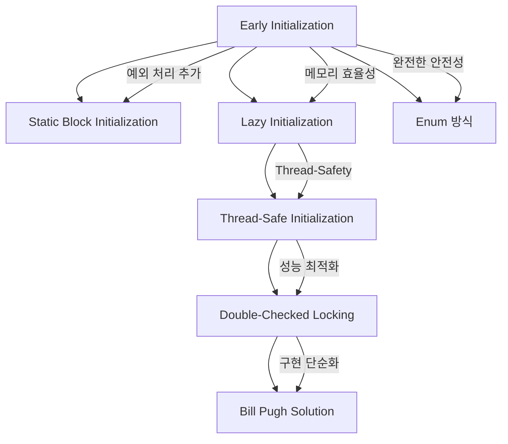

---
tags:
  - 객체지향
  - 디자인패턴
  - JAVA
  - GoF
aliases:
  - Singleton Pattern
  - 싱글턴
title: 싱글톤 패턴
created: 2025-01-16T00:00:00.000Z
note-type: COMMON
completed: true
---

작성 날짜: 2025-01-16
작성 시간: 10:50

----

## 내용(Content)

### 주제 요약

>[!summary]
>클래스의 인스턴스가 오직 하나만 생성되도록 보장하는 GoF 생성 패턴

**싱글톤 패턴(Singleton Pattern)**은 GoF(Gang of Four) 디자인 패턴 중 생성 패턴의 하나로, 특정 클래스의 인스턴스가 프로그램 전체에서 단 하나만 존재하도록 보장하는 패턴이다. 이 패턴은 전역 접근점을 제공하면서도 인스턴스 생성을 엄격히 제어하여 메모리 효율성과 일관성을 보장한다.

### 싱글톤 패턴의 정의와 목적

싱글톤 패턴은 다음과 같은 두 가지 핵심 목적을 가진다:

1. **인스턴스 생성 제어**: 클래스의 인스턴스가 오직 하나만 생성되도록 보장
2. **전역 접근점 제공**: 해당 인스턴스에 대한 전역적인 접근 방법 제공

이는 데이터베이스 연결, 로깅 시스템, 설정 관리 등과 같이 시스템 전체에서 하나의 인스턴스만 필요한 경우에 유용하다.

### GoF 생성 패턴으로서의 특징

싱글톤 패턴은 GoF의 5가지 생성 패턴 중 하나로, 다음과 같은 특징을 가진다:

- **객체 생성 캡슐화**: 인스턴스 생성 로직을 클래스 내부에 캡슐화
- **생성 시점 제어**: 필요한 시점에 인스턴스를 생성하는 지연 초기화 지원
- **메모리 효율성**: 불필요한 객체 생성을 방지하여 메모리 사용량 최적화

### 기본 구현 원리

싱글톤 패턴의 기본 구현은 다음 세 가지 요소로 구성된다:

1. **Private 생성자**: 외부에서 직접 인스턴스를 생성하지 못하도록 제한
2. **Static 인스턴스 변수**: 클래스 레벨에서 유일한 인스턴스를 저장
3. **Static 접근 메서드**: 인스턴스에 접근할 수 있는 전역 접근점 제공

```java
public class BasicSingleton {
    private static BasicSingleton instance;
    
    // Private 생성자로 외부 인스턴스 생성 방지
    private BasicSingleton() {}
    
    // 전역 접근점 제공
    public static BasicSingleton getInstance() {
        if (instance == null) {
            instance = new BasicSingleton();
        }
        return instance;
    }
}
```

### 핵심 특징 요약

| 특징 | 설명 | 이점 |
|------|------|------|
| **인스턴스 유일성** | 클래스당 하나의 인스턴스만 존재 | 메모리 효율성, 상태 일관성 |
| **전역 접근** | 어디서든 동일한 인스턴스에 접근 가능 | 편의성, 데이터 공유 |
| **지연 초기화** | 필요한 시점에 인스턴스 생성 | 성능 최적화, 리소스 절약 |
| **생성 제어** | 인스턴스 생성 시점과 방법을 제어 | 초기화 로직 캡슐화 |

## 싱글톤 패턴 구현 방법 상세 분석

싱글톤 패턴은 시간이 지나면서 다양한 문제점들이 발견되고 해결되면서 여러 구현 방법이 발전해왔다. 다음은 주요한 6가지 구현 방법과 그 진화 과정이다.

### 1. Early Initialization (즉시 초기화)

클래스 로딩 시점에 즉시 인스턴스를 생성하는 가장 간단한 방법이다.

```java
public class EarlySingleton {
    // 클래스 로딩 시점에 인스턴스 생성
    private static final EarlySingleton INSTANCE = new EarlySingleton();
    
    private EarlySingleton() {}
    
    public static EarlySingleton getInstance() {
        return INSTANCE;
    }
}
```

**장점:**
- 구현이 매우 간단하고 명확함
- Thread-safe 보장 (클래스 로더가 동기화 처리)
- 성능이 우수함 (동기화 오버헤드 없음)

**단점:**
- 사용하지 않아도 인스턴스가 생성되어 메모리 낭비 가능
- 인스턴스 생성 시 예외 처리 어려움
- 지연 초기화 불가능

**사용 시나리오:** 인스턴스가 반드시 사용되고, 생성 비용이 크지 않은 경우

### 2. Static Block Initialization

Static 블록을 사용하여 예외 처리를 추가한 방법이다.

```java
public class StaticBlockSingleton {
    private static StaticBlockSingleton instance;
    
    static {
        try {
            instance = new StaticBlockSingleton();
        } catch (Exception e) {
            throw new RuntimeException("싱글톤 인스턴스 생성 실패", e);
        }
    }
    
    private StaticBlockSingleton() {}
    
    public static StaticBlockSingleton getInstance() {
        return instance;
    }
}
```

**장점:**
- Early Initialization의 장점 유지
- 예외 처리 가능
- Thread-safe 보장

**단점:**
- 여전히 지연 초기화 불가능
- 메모리 낭비 문제 지속

**사용 시나리오:** 인스턴스 생성 시 복잡한 초기화나 예외 처리가 필요한 경우

### 3. Lazy Initialization (지연 초기화)

필요한 시점에 인스턴스를 생성하는 방법이다.

```java
public class LazySingleton {
    private static LazySingleton instance;
    
    private LazySingleton() {}
    
    public static LazySingleton getInstance() {
        if (instance == null) {
            instance = new LazySingleton();
        }
        return instance;
    }
}
```

**장점:**
- 메모리 효율적 (필요할 때만 생성)
- 지연 초기화 지원

**단점:**
- **Thread-safe하지 않음** (멀티스레드 환경에서 문제)
- 여러 스레드가 동시에 접근하면 여러 인스턴스 생성 가능

**사용 시나리오:** 단일 스레드 환경에서만 사용 권장

### 4. Thread-Safe Initialization

synchronized 키워드를 사용하여 스레드 안전성을 보장하는 방법이다.

```java
public class ThreadSafeSingleton {
    private static ThreadSafeSingleton instance;
    
    private ThreadSafeSingleton() {}
    
    public static synchronized ThreadSafeSingleton getInstance() {
        if (instance == null) {
            instance = new ThreadSafeSingleton();
        }
        return instance;
    }
}
```

**장점:**
- Thread-safe 보장
- 지연 초기화 지원

**단점:**
- **성능 저하** (매번 동기화 오버헤드)
- 인스턴스 생성 후에도 불필요한 동기화 발생

**사용 시나리오:** Thread-safety가 중요하지만 성능이 크게 중요하지 않은 경우

### 5. Double-Checked Locking

동기화 성능 문제를 해결하기 위한 최적화된 방법이다.

```java
public class DoubleCheckedSingleton {
    // volatile 키워드로 메모리 가시성 보장
    private static volatile DoubleCheckedSingleton instance;
    
    private DoubleCheckedSingleton() {}
    
    public static DoubleCheckedSingleton getInstance() {
        if (instance == null) {
            synchronized (DoubleCheckedSingleton.class) {
                if (instance == null) {
                    instance = new DoubleCheckedSingleton();
                }
            }
        }
        return instance;
    }
}
```

**장점:**
- Thread-safe 보장
- 성능 최적화 (인스턴스 생성 후 동기화 불필요)
- 지연 초기화 지원

**단점:**
- 구현 복잡성 증가
- volatile 키워드 필수 (메모리 가시성 문제)
- JVM 최적화에 의한 미묘한 버그 가능성

**사용 시나리오:** 성능과 Thread-safety를 모두 고려해야 하는 경우

### 6. Bill Pugh Solution (권장)

Static 내부 클래스를 활용한 우아한 해결책이다.

```java
public class BillPughSingleton {
    private BillPughSingleton() {}
    
    // Static 내부 클래스
    private static class SingletonHelper {
        private static final BillPughSingleton INSTANCE = new BillPughSingleton();
    }
    
    public static BillPughSingleton getInstance() {
        return SingletonHelper.INSTANCE;
    }
}
```

**장점:**
- Thread-safe 보장 (클래스 로더 메커니즘 활용)
- 지연 초기화 지원 (내부 클래스는 사용 시점에 로딩)
- 성능 우수 (동기화 오버헤드 없음)
- 구현 간단

**단점:**
- 리플렉션 공격에 취약

**사용 시나리오:** **가장 권장되는 방법** - 대부분의 상황에서 최적

### 7. Enum 방식 (권장)

Enum의 특성을 활용한 가장 안전한 구현 방법이다.

```java
public enum EnumSingleton {
    INSTANCE;
    
    public void doSomething() {
        // 비즈니스 로직
    }
}

// 사용법
EnumSingleton.INSTANCE.doSomething();
```

**장점:**
- Thread-safe 보장
- 직렬화 안전성 보장
- 리플렉션 공격 방지
- 구현 매우 간단

**단점:**
- 지연 초기화 불가능
- 상속 불가능 (Enum은 다른 클래스 상속 불가)

**사용 시나리오:** **가장 안전한 방법** - 보안이 중요한 환경에서 권장

### 구현 방법 진화 과정



### 구현 방법 비교표

| 구현 방법 | Thread-Safe | 지연 초기화 | 성능 | 구현 복잡도 | 권장도 |
|-----------|-------------|-------------|------|-------------|--------|
| Early Initialization | ✅ | ❌ | ⭐⭐⭐ | ⭐ | ⭐⭐ |
| Static Block | ✅ | ❌ | ⭐⭐⭐ | ⭐⭐ | ⭐⭐ |
| Lazy Initialization | ❌ | ✅ | ⭐⭐⭐ | ⭐ | ❌ |
| Thread-Safe | ✅ | ✅ | ⭐ | ⭐⭐ | ⭐ |
| Double-Checked | ✅ | ✅ | ⭐⭐ | ⭐⭐⭐ | ⭐⭐ |
| **Bill Pugh** | ✅ | ✅ | ⭐⭐⭐ | ⭐⭐ | **⭐⭐⭐** |
| **Enum** | ✅ | ❌ | ⭐⭐⭐ | ⭐ | **⭐⭐⭐** |