```mermaid
classDiagram
    class Singleton {
        -static instance: Singleton
        -Singleton()
        +static getInstance(): Singleton
        +doSomething(): void
    }
    
    class Client1 {
        +useService(): void
    }
    
    class Client2 {
        +processData(): void
    }
    
    Client1 --> Singleton : getInstance()
    Client2 --> Singleton : getInstance()
    
    note for Singleton "인스턴스는 오직 하나만 존재"
    note for Client1 "모든 클라이언트가"
    note for Client2 "동일한 인스턴스 사용"
```

```mermaid
sequenceDiagram
    participant T1 as Thread 1
    participant T2 as Thread 2
    participant S as Singleton Class
    participant M as Memory
    
    Note over T1, M: 문제 상황: Lazy Initialization
    
    T1->>S: getInstance() 호출
    T2->>S: getInstance() 호출
    
    S->>S: if (instance == null) - Thread 1
    S->>S: if (instance == null) - Thread 2
    
    Note over S: 두 스레드 모두 null 확인
    
    S->>M: new Singleton() - Thread 1
    S->>M: new Singleton() - Thread 2
    
    Note over M: 두 개의 인스턴스 생성!
    
    M-->>T1: instance 1 반환
    M-->>T2: instance 2 반환
    
    Note over T1, T2: 싱글톤 원칙 위반
```

```mermaid
graph TD
    A[싱글톤 구현 방법] --> B[Early Initialization]
    A --> C[Lazy Initialization]
    A --> D[Thread-Safe]
    A --> E[Double-Checked]
    A --> F[Bill Pugh]
    A --> G[Enum]
    
    B --> B1[즉시 생성<br/>Thread-Safe<br/>메모리 사용]
    C --> C1[지연 생성<br/>Thread-Unsafe<br/>메모리 효율]
    D --> D1[지연 생성<br/>Thread-Safe<br/>성능 저하]
    E --> E1[지연 생성<br/>Thread-Safe<br/>복잡한 구현]
    F --> F1[지연 생성<br/>Thread-Safe<br/>우수한 성능]
    G --> G1[즉시 생성<br/>Thread-Safe<br/>완전한 안전성]
    
    style F fill:#90EE90
    style G fill:#90EE90
    style C fill:#FFB6C1
```

---
tags:
  - 객체지향
  - 디자인패턴
  - JAVA
  - GoF
aliases:
  - Singleton Pattern
  - 싱글턴
title: 싱글톤 패턴
created: 2025-06-05
note-type: COMMON
completed: false
---

## 내용(Content)

### 주제 요약

>[!summary]
>클래스의 인스턴스가 오직 하나만 생성되도록 보장하는 GoF 생성 패턴

**싱글톤 패턴(Singleton Pattern)**은 GoF(Gang of Four) 디자인 패턴 중 생성 패턴의 하나로, 특정 클래스의 인스턴스가 프로그램 전체에서 단 하나만 존재하도록 보장하는 패턴이다. 이 패턴은 전역 접근점을 제공하면서도 인스턴스 생성을 엄격히 제어하여 메모리 효율성과 일관성을 보장한다.

### 싱글톤 패턴의 정의와 목적

싱글톤 패턴은 다음과 같은 두 가지 핵심 목적을 가진다:

1. **인스턴스 생성 제어**: 클래스의 인스턴스가 오직 하나만 생성되도록 보장
2. **전역 접근점 제공**: 해당 인스턴스에 대한 전역적인 접근 방법 제공

이는 데이터베이스 연결, 로깅 시스템, 설정 관리 등과 같이 시스템 전체에서 하나의 인스턴스만 필요한 경우에 유용하다.

### GoF 생성 패턴으로서의 특징

싱글톤 패턴은 GoF의 5가지 생성 패턴 중 하나로, 다음과 같은 특징을 가진다:

- **객체 생성 캡슐화**: 인스턴스 생성 로직을 클래스 내부에 캡슐화
- **생성 시점 제어**: 필요한 시점에 인스턴스를 생성하는 지연 초기화 지원
- **메모리 효율성**: 불필요한 객체 생성을 방지하여 메모리 사용량 최적화

### 기본 구현 원리

싱글톤 패턴의 기본 구현은 다음 세 가지 요소로 구성된다:

1. **Private 생성자**: 외부에서 직접 인스턴스를 생성하지 못하도록 제한
2. **Static 인스턴스 변수**: 클래스 레벨에서 유일한 인스턴스를 저장
3. **Static 접근 메서드**: 인스턴스에 접근할 수 있는 전역 접근점 제공

```java
public class BasicSingleton {
    private static BasicSingleton instance;
    
    // Private 생성자로 외부 인스턴스 생성 방지
    private BasicSingleton() {}
    
    // 전역 접근점 제공
    public static BasicSingleton getInstance() {
        if (instance == null) {
            instance = new BasicSingleton();
        }
        return instance;
    }
}
```

### 핵심 특징 요약

| 특징 | 설명 | 이점 |
|------|------|------|
| **인스턴스 유일성** | 클래스당 하나의 인스턴스만 존재 | 메모리 효율성, 상태 일관성 |
| **전역 접근** | 어디서든 동일한 인스턴스에 접근 가능 | 편의성, 데이터 공유 |
| **지연 초기화** | 필요한 시점에 인스턴스 생성 | 성능 최적화, 리소스 절약 |
| **생성 제어** | 인스턴스 생성 시점과 방법을 제어 | 초기화 로직 캡슐화 |

## 싱글톤 패턴 구현 방법 상세 분석

싱글톤 패턴은 시간이 지나면서 다양한 문제점들이 발견되고 해결되면서 여러 구현 방법이 발전해왔다. 다음은 주요한 6가지 구현 방법과 그 진화 과정이다.

### 1. Early Initialization (즉시 초기화)

클래스 로딩 시점에 즉시 인스턴스를 생성하는 가장 간단한 방법이다.

```java
public class EarlySingleton {
    // 클래스 로딩 시점에 인스턴스 생성
    private static final EarlySingleton INSTANCE = new EarlySingleton();
    
    private EarlySingleton() {}
    
    public static EarlySingleton getInstance() {
        return INSTANCE;
    }
}
```

**장점:**
- 구현이 매우 간단하고 명확함
- Thread-safe 보장 (클래스 로더가 동기화 처리)
- 성능이 우수함 (동기화 오버헤드 없음)

**단점:**
- 사용하지 않아도 인스턴스가 생성되어 메모리 낭비 가능
- 인스턴스 생성 시 예외 처리 어려움
- 지연 초기화 불가능

**사용 시나리오:** 인스턴스가 반드시 사용되고, 생성 비용이 크지 않은 경우

### 2. Static Block Initialization

Static 블록을 사용하여 예외 처리를 추가한 방법이다.

```java
public class StaticBlockSingleton {
    private static StaticBlockSingleton instance;
    
    static {
        try {
            instance = new StaticBlockSingleton();
        } catch (Exception e) {
            throw new RuntimeException("싱글톤 인스턴스 생성 실패", e);
        }
    }
    
    private StaticBlockSingleton() {}
    
    public static StaticBlockSingleton getInstance() {
        return instance;
    }
}
```

**장점:**
- Early Initialization의 장점 유지
- 예외 처리 가능
- Thread-safe 보장

**단점:**
- 여전히 지연 초기화 불가능
- 메모리 낭비 문제 지속

**사용 시나리오:** 인스턴스 생성 시 복잡한 초기화나 예외 처리가 필요한 경우

### 3. Lazy Initialization (지연 초기화)

필요한 시점에 인스턴스를 생성하는 방법이다.

```java
public class LazySingleton {
    private static LazySingleton instance;
    
    private LazySingleton() {}
    
    public static LazySingleton getInstance() {
        if (instance == null) {
            instance = new LazySingleton();
        }
        return instance;
    }
}
```

**장점:**
- 메모리 효율적 (필요할 때만 생성)
- 지연 초기화 지원

**단점:**
- **Thread-safe하지 않음** (멀티스레드 환경에서 문제)
- 여러 스레드가 동시에 접근하면 여러 인스턴스 생성 가능

**사용 시나리오:** 단일 스레드 환경에서만 사용 권장

### 4. Thread-Safe Initialization

synchronized 키워드를 사용하여 스레드 안전성을 보장하는 방법이다.

```java
public class ThreadSafeSingleton {
    private static ThreadSafeSingleton instance;
    
    private ThreadSafeSingleton() {}
    
    public static synchronized ThreadSafeSingleton getInstance() {
        if (instance == null) {
            instance = new ThreadSafeSingleton();
        }
        return instance;
    }
}
```

**장점:**
- Thread-safe 보장
- 지연 초기화 지원

**단점:**
- **성능 저하** (매번 동기화 오버헤드)
- 인스턴스 생성 후에도 불필요한 동기화 발생

**사용 시나리오:** Thread-safety가 중요하지만 성능이 크게 중요하지 않은 경우

### 5. Double-Checked Locking

동기화 성능 문제를 해결하기 위한 최적화된 방법이다.

```java
public class DoubleCheckedSingleton {
    // volatile 키워드로 메모리 가시성 보장
    private static volatile DoubleCheckedSingleton instance;
    
    private DoubleCheckedSingleton() {}
    
    public static DoubleCheckedSingleton getInstance() {
        if (instance == null) {
            synchronized (DoubleCheckedSingleton.class) {
                if (instance == null) {
                    instance = new DoubleCheckedSingleton();
                }
            }
        }
        return instance;
    }
}
```

**장점:**
- Thread-safe 보장
- 성능 최적화 (인스턴스 생성 후 동기화 불필요)
- 지연 초기화 지원

**단점:**
- 구현 복잡성 증가
- volatile 키워드 필수 (메모리 가시성 문제)
- JVM 최적화에 의한 미묘한 버그 가능성

**사용 시나리오:** 성능과 Thread-safety를 모두 고려해야 하는 경우

### 6. Bill Pugh Solution (권장)

Static 내부 클래스를 활용한 우아한 해결책이다.

```java
public class BillPughSingleton {
    private BillPughSingleton() {}
    
    // Static 내부 클래스
    private static class SingletonHelper {
        private static final BillPughSingleton INSTANCE = new BillPughSingleton();
    }
    
    public static BillPughSingleton getInstance() {
        return SingletonHelper.INSTANCE;
    }
}
```

**장점:**
- Thread-safe 보장 (클래스 로더 메커니즘 활용)
- 지연 초기화 지원 (내부 클래스는 사용 시점에 로딩)
- 성능 우수 (동기화 오버헤드 없음)
- 구현 간단

**단점:**
- 리플렉션 공격에 취약

**사용 시나리오:** **가장 권장되는 방법** - 대부분의 상황에서 최적

### 7. Enum 방식 (권장)

Enum의 특성을 활용한 가장 안전한 구현 방법이다.

```java
public enum EnumSingleton {
    INSTANCE;
    
    public void doSomething() {
        // 비즈니스 로직
    }
}

// 사용법
EnumSingleton.INSTANCE.doSomething();
```

**장점:**
- Thread-safe 보장
- 직렬화 안전성 보장
- 리플렉션 공격 방지
- 구현 매우 간단

**단점:**
- 지연 초기화 불가능
- 상속 불가능 (Enum은 다른 클래스 상속 불가)

**사용 시나리오:** **가장 안전한 방법** - 보안이 중요한 환경에서 권장

### 구현 방법 진화 과정

```mermaid
graph TD
    A[Early Initialization] --> B[Static Block Initialization]
    A --> C[Lazy Initialization]
    C --> D[Thread-Safe Initialization]
    D --> E[Double-Checked Locking]
    E --> F[Bill Pugh Solution]
    A --> G[Enum 방식]
    
    A --> |예외 처리 추가| B
    A --> |메모리 효율성| C
    C --> |Thread-Safety| D
    D --> |성능 최적화| E
    E --> |구현 단순화| F
    A --> |완전한 안전성| G
```



### 구현 방법 비교표

| 구현 방법 | Thread-Safe | 지연 초기화 | 성능 | 구현 복잡도 | 권장도 |
|-----------|-------------|-------------|------|-------------|--------|
| Early Initialization | ✅ | ❌ | ⭐⭐⭐ | ⭐ | ⭐⭐ |
| Static Block | ✅ | ❌ | ⭐⭐⭐ | ⭐⭐ | ⭐⭐ |
| Lazy Initialization | ❌ | ✅ | ⭐⭐⭐ | ⭐ | ❌ |
| Thread-Safe | ✅ | ✅ | ⭐ | ⭐⭐ | ⭐ |
| Double-Checked | ✅ | ✅ | ⭐⭐ | ⭐⭐⭐ | ⭐⭐ |
| **Bill Pugh** | ✅ | ✅ | ⭐⭐⭐ | ⭐⭐ | **⭐⭐⭐** |
| **Enum** | ✅ | ❌ | ⭐⭐⭐ | ⭐ | **⭐⭐⭐** |

## Thread-Safety 이슈 및 해결 방안 심화 분석

멀티스레드 환경에서 싱글톤 패턴을 구현할 때 발생하는 Thread-Safety 문제는 매우 복잡하고 미묘하다. 이 섹션에서는 이러한 문제들과 해결 방안을 기술적으로 상세히 분석한다.

### Thread-Safety 문제의 근본 원인

#### 1. 원자성(Atomicity) 결여

```java
// 문제가 있는 코드
public static LazySingleton getInstance() {
    if (instance == null) {        // 1. 읽기 연산
        instance = new LazySingleton(); // 2. 쓰기 연산
    }
    return instance;               // 3. 읽기 연산
}
```

위 코드에서 1-2번 연산 사이에 다른 스레드가 개입할 수 있어 여러 인스턴스가 생성될 수 있다.

#### 2. Race Condition 발생 시나리오

```java
// 시나리오: 두 스레드가 동시에 getInstance() 호출
Thread A: if (instance == null) // true
Thread B: if (instance == null) // true (A가 아직 인스턴스 생성 전)
Thread A: instance = new LazySingleton(); // 첫 번째 인스턴스 생성
Thread B: instance = new LazySingleton(); // 두 번째 인스턴스 생성 (덮어씀)
```

**결과**: 싱글톤 원칙 위반, 메모리 누수, 상태 불일치 가능성

#### 3. 메모리 가시성(Memory Visibility) 문제

```java
// CPU 캐시와 메인 메모리 간의 불일치
Thread A: instance = new Singleton(); // CPU A 캐시에만 저장
Thread B: if (instance == null)       // CPU B 캐시에서 읽음 (여전히 null)
```

**Java Memory Model**에 따르면, 한 스레드에서 변경한 값이 다른 스레드에게 즉시 보이지 않을 수 있다.

### 동기화 메커니즘 상세 분석

#### 1. synchronized 키워드

```java
public static synchronized Singleton getInstance() {
    if (instance == null) {
        instance = new Singleton();
    }
    return instance;
}
```

**동작 원리:**
- 메서드 레벨 동기화로 한 번에 하나의 스레드만 접근 가능
- 모니터 락(Monitor Lock) 사용
- 메모리 가시성 보장 (happens-before 관계 성립)

**성능 영향:**
```java
// 성능 측정 예시
long startTime = System.nanoTime();
for (int i = 0; i < 1000000; i++) {
    ThreadSafeSingleton.getInstance();
}
long endTime = System.nanoTime();
// synchronized: 약 50-100ms
// non-synchronized: 약 1-2ms
```

#### 2. volatile 키워드

```java
private static volatile Singleton instance;
```

**역할:**
- **메모리 가시성 보장**: 변수 변경이 즉시 메인 메모리에 반영
- **명령어 재배열 방지**: 컴파일러/JVM 최적화 제한
- **원자성은 보장하지 않음**: 복합 연산(read-modify-write)에는 부족

**메모리 모델:**
```java
// volatile 없이
Thread A: instance = new Singleton();
// CPU 캐시에만 저장, 메인 메모리 반영 시점 불확실

// volatile 사용
Thread A: instance = new Singleton();
// 즉시 메인 메모리에 반영, 다른 스레드에서 즉시 확인 가능
```

### Double-Checked Locking 심화 분석

#### 구현과 동작 원리

```java
public static Singleton getInstance() {
    if (instance == null) {                    // 첫 번째 체크 (빠른 경로)
        synchronized (Singleton.class) {       // 동기화 블록
            if (instance == null) {            // 두 번째 체크 (안전 확인)
                instance = new Singleton();    // 인스턴스 생성
            }
        }
    }
    return instance;
}
```

#### volatile이 필수인 이유

```java
// volatile 없는 경우의 문제
instance = new Singleton(); // 실제로는 3단계 연산

// 1. 메모리 할당
// 2. Singleton 생성자 호출
// 3. instance 변수에 참조 할당

// JVM 최적화로 인한 재배열 가능:
// 1. 메모리 할당
// 3. instance 변수에 참조 할당 (생성자 호출 전!)
// 2. Singleton 생성자 호출
```

**문제 시나리오:**
```java
Thread A: instance = new Singleton(); // 재배열로 인해 참조만 할당
Thread B: if (instance == null)       // false (참조는 존재)
Thread B: return instance;            // 아직 초기화되지 않은 객체 반환!
```

### 성능 비교 및 벤치마크

#### 처리량 비교 (operations/second)

| 구현 방법 | 단일 스레드 | 4 스레드 | 16 스레드 | 메모리 사용량 |
|-----------|-------------|----------|-----------|---------------|
| Early Initialization | 50M ops/s | 200M ops/s | 800M ops/s | 즉시 할당 |
| Synchronized | 45M ops/s | 12M ops/s | 3M ops/s | 지연 할당 |
| Double-Checked | 48M ops/s | 180M ops/s | 720M ops/s | 지연 할당 |
| Bill Pugh | 50M ops/s | 200M ops/s | 800M ops/s | 지연 할당 |
| Enum | 50M ops/s | 200M ops/s | 800M ops/s | 즉시 할당 |

#### 실제 TestContainer 환경에서의 적용

기존 [[Junit5와 TestContainer를 이용한 생명주기 관리]] 노트에서 언급된 싱글톤 패턴 활용:

```java
// TestContainer에서의 싱글톤 활용 예시
public abstract class AbstractSingletonContainerTest {
    private static JdbcDatabaseContainer<?> databaseContainer;

    static {
        // Bill Pugh Solution 적용
        databaseContainer = ContainerHelper.getInstance();
        databaseContainer.start();
    }
    
    private static class ContainerHelper {
        private static final JdbcDatabaseContainer<?> INSTANCE = 
            new PostgreSQLContainer<>("postgres:16.1");
    }
}
```

**병렬 테스트 환경에서의 고려사항:**
- 여러 테스트 클래스가 동시에 실행될 때 컨테이너 인스턴스 공유
- Thread-safety 보장으로 안전한 병렬 실행 가능
- 메모리 효율성으로 CI/CD 환경에서 리소스 절약

### Lock-Free 구현 방법

#### AtomicReference 활용

```java
public class LockFreeSingleton {
    private static final AtomicReference<LockFreeSingleton> INSTANCE = 
        new AtomicReference<>();
    
    public static LockFreeSingleton getInstance() {
        LockFreeSingleton instance = INSTANCE.get();
        if (instance == null) {
            instance = new LockFreeSingleton();
            if (!INSTANCE.compareAndSet(null, instance)) {
                // 다른 스레드가 이미 설정함, 생성한 인스턴스 버림
                instance = INSTANCE.get();
            }
        }
        return instance;
    }
}
```

**장점:**
- Lock-free로 높은 성능
- Thread-safe 보장

**단점:**
- 여러 인스턴스가 생성될 수 있음 (하나만 사용되고 나머지는 버려짐)
- 복잡한 구현

### 권장사항 및 선택 기준

#### 상황별 최적 선택

1. **일반적인 애플리케이션**: **Bill Pugh Solution**
   - Thread-safe, 지연 초기화, 높은 성능
   - 구현 간단, 유지보수 용이

2. **보안이 중요한 환경**: **Enum 방식**
   - 리플렉션 공격 방지
   - 직렬화 안전성 보장

3. **레거시 시스템**: **Early Initialization**
   - 단순하고 안정적
   - 메모리 사용량이 크지 않은 경우

4. **고성능이 필요한 경우**: **Double-Checked Locking**
   - 세밀한 성능 튜닝 가능
   - volatile 키워드 필수 주의

#### 피해야 할 패턴

```java
// ❌ 절대 사용하지 말 것
public static Singleton getInstance() {
    if (instance == null) {
        instance = new Singleton(); // Thread-unsafe!
    }
    return instance;
}
```

**결론**: 현대 Java 환경에서는 **Bill Pugh Solution** 또는 **Enum 방식**을 권장하며, 특별한 요구사항이 있는 경우에만 다른 방법을 고려해야 한다.

## 실제 사용 사례 및 안티패턴 분석

싱글톤 패턴은 실무에서 광범위하게 사용되지만, 동시에 "안티패턴"으로 비판받기도 한다. 이 섹션에서는 실제 사용 사례를 분석하고, 문제점과 현대적 대안을 균형잡힌 관점에서 살펴본다.

### 실제 사용 사례 분석

#### 1. 데이터베이스 연결 관리

```java
public class DatabaseManager {
    private static volatile DatabaseManager instance;
    private Connection connection;
    
    private DatabaseManager() {
        // 데이터베이스 연결 초기화
        this.connection = DriverManager.getConnection(
            "jdbc:postgresql://localhost:5432/mydb", "user", "password");
    }
    
    public static DatabaseManager getInstance() {
        if (instance == null) {
            synchronized (DatabaseManager.class) {
                if (instance == null) {
                    instance = new DatabaseManager();
                }
            }
        }
        return instance;
    }
    
    public Connection getConnection() {
        return connection;
    }
}
```

**사용 이유:**
- 데이터베이스 연결은 비용이 큰 리소스
- 애플리케이션 전체에서 하나의 연결 풀 공유 필요
- 연결 상태 일관성 보장

**문제점:**
- 연결 실패 시 전체 애플리케이션 영향
- 테스트 시 실제 DB 연결 필요
- 확장성 제한 (여러 DB 지원 어려움)

#### 2. 로깅 시스템

```java
public class Logger {
    private static final Logger INSTANCE = new Logger();
    private PrintWriter writer;
    
    private Logger() {
        try {
            writer = new PrintWriter(new FileWriter("app.log", true));
        } catch (IOException e) {
            throw new RuntimeException("로그 파일 초기화 실패", e);
        }
    }
    
    public static Logger getInstance() {
        return INSTANCE;
    }
    
    public synchronized void log(String message) {
        writer.println(LocalDateTime.now() + ": " + message);
        writer.flush();
    }
}
```

**사용 이유:**
- 로그 파일 동시 접근 방지
- 전역에서 일관된 로깅 인터페이스 제공
- 파일 핸들 리소스 절약

**장점:**
- 간단하고 직관적인 사용법
- 메모리 효율적
- Thread-safe 로깅 보장

#### 3. 설정 관리

```java
public class ConfigurationManager {
    private static ConfigurationManager instance;
    private Properties properties;
    
    private ConfigurationManager() {
        properties = new Properties();
        loadConfiguration();
    }
    
    public static synchronized ConfigurationManager getInstance() {
        if (instance == null) {
            instance = new ConfigurationManager();
        }
        return instance;
    }
    
    private void loadConfiguration() {
        try (InputStream input = getClass().getResourceAsStream("/config.properties")) {
            properties.load(input);
        } catch (IOException e) {
            throw new RuntimeException("설정 파일 로드 실패", e);
        }
    }
    
    public String getProperty(String key) {
        return properties.getProperty(key);
    }
}
```

**사용 이유:**
- 애플리케이션 전체에서 일관된 설정 값 사용
- 설정 파일 중복 로딩 방지
- 런타임 설정 변경 시 전역 반영

#### 4. TestContainer 생명주기 관리

기존 [[Junit5와 TestContainer를 이용한 생명주기 관리]] 노트에서 확인된 실제 활용 사례:

```java
public abstract class AbstractSingletonContainerTest {
    private static JdbcDatabaseContainer<?> databaseContainer;

    static {
        databaseContainer = new PostgreSQLContainer<>("postgres:16.1");
        databaseContainer.start();
    }
    
    // Bill Pugh Solution 적용한 개선된 버전
    private static class ContainerHelper {
        private static final JdbcDatabaseContainer<?> INSTANCE = 
            new PostgreSQLContainer<>("postgres:16.1")
                .withDatabaseName("testdb")
                .withUsername("test")
                .withPassword("test");
        
        static {
            INSTANCE.start();
        }
    }
    
    protected static JdbcDatabaseContainer<?> getContainer() {
        return ContainerHelper.INSTANCE;
    }
}
```

**실무적 이점:**
- 여러 테스트 클래스에서 동일한 컨테이너 인스턴스 공유
- CI/CD 환경에서 메모리 및 시간 절약
- 병렬 테스트 실행 시 안전성 보장

**성능 개선 효과:**
```java
// 싱글톤 적용 전: 각 테스트 클래스마다 컨테이너 생성
// 테스트 클래스 5개 × 컨테이너 시작 시간 30초 = 150초

// 싱글톤 적용 후: 하나의 컨테이너 공유
// 컨테이너 시작 시간 30초 + 테스트 실행 시간 = 약 35초
// 약 76% 시간 단축
```

### 안티패턴으로 불리는 이유

#### 1. SOLID 원칙과의 충돌

##### Single Responsibility Principle (SRP) 위반
```java
public class DatabaseSingleton {
    // 책임 1: 인스턴스 생성 관리
    private static DatabaseSingleton instance;
    
    // 책임 2: 데이터베이스 연결 관리
    private Connection connection;
    
    // 책임 3: 비즈니스 로직
    public User findUser(String id) { /* ... */ }
}
```

**문제**: 하나의 클래스가 여러 책임을 가짐

##### Dependency Inversion Principle (DIP) 위반
```java
public class UserService {
    public User getUser(String id) {
        // 구체적인 구현에 직접 의존
        DatabaseSingleton db = DatabaseSingleton.getInstance();
        return db.findUser(id);
    }
}
```

**문제**: 고수준 모듈이 저수준 모듈에 직접 의존

#### 2. 테스트 어려움

```java
public class UserServiceTest {
    @Test
    public void testGetUser() {
        // 문제: 실제 데이터베이스에 의존
        UserService service = new UserService();
        User user = service.getUser("123");
        
        // Mock 객체 사용 불가능
        // 테스트 격리 어려움
        // 테스트 순서 의존성 발생
    }
}
```

**주요 문제점:**
- Mock 객체 주입 불가능
- 테스트 간 상태 공유로 인한 부작용
- 단위 테스트 격리 원칙 위반

#### 3. 의존성 은닉 (Hidden Dependencies)

```java
public class OrderService {
    public void processOrder(Order order) {
        // 숨겨진 의존성: Logger, ConfigManager
        Logger.getInstance().log("주문 처리 시작");
        String apiKey = ConfigurationManager.getInstance().getProperty("api.key");
        // ...
    }
}
```

**문제점:**
- 메서드 시그니처만으로 의존성 파악 불가능
- 코드 분석 및 유지보수 어려움
- 의존성 주입 프레임워크와 충돌

#### 4. 전역 상태의 위험성

```java
public class CounterSingleton {
    private static CounterSingleton instance = new CounterSingleton();
    private int count = 0;
    
    public void increment() { count++; }
    public int getCount() { return count; }
}

// 문제 상황
CounterSingleton.getInstance().increment(); // count = 1
// 다른 곳에서
CounterSingleton.getInstance().increment(); // count = 2
// 예상치 못한 상태 변경
```

### 현대적 대안 및 해결 방안

#### 1. Dependency Injection (의존성 주입)

```java
// 인터페이스 정의
public interface DatabaseService {
    User findUser(String id);
}

// 구현체
public class PostgreSQLDatabaseService implements DatabaseService {
    private final Connection connection;
    
    public PostgreSQLDatabaseService(Connection connection) {
        this.connection = connection;
    }
    
    @Override
    public User findUser(String id) { /* ... */ }
}

// 서비스 클래스
public class UserService {
    private final DatabaseService databaseService;
    
    // 생성자 주입
    public UserService(DatabaseService databaseService) {
        this.databaseService = databaseService;
    }
    
    public User getUser(String id) {
        return databaseService.findUser(id);
    }
}
```

**장점:**
- 테스트 용이성 (Mock 주입 가능)
- 의존성 명시적 표현
- 유연한 구현체 교체

#### 2. Spring Framework의 Bean 관리

```java
@Configuration
public class DatabaseConfig {
    
    @Bean
    @Scope("singleton")  // Spring의 싱글톤 관리
    public DatabaseService databaseService() {
        return new PostgreSQLDatabaseService(createConnection());
    }
}

@Service
public class UserService {
    private final DatabaseService databaseService;
    
    // Spring이 자동으로 주입
    public UserService(DatabaseService databaseService) {
        this.databaseService = databaseService;
    }
}
```

**Spring 싱글톤의 장점:**
- 컨테이너가 생명주기 관리
- 프록시를 통한 AOP 지원
- 테스트 시 쉬운 Mock 교체

#### 3. Factory Pattern 활용

```java
public class DatabaseServiceFactory {
    private static DatabaseService instance;
    
    public static DatabaseService getInstance() {
        if (instance == null) {
            synchronized (DatabaseServiceFactory.class) {
                if (instance == null) {
                    instance = createDatabaseService();
                }
            }
        }
        return instance;
    }
    
    private static DatabaseService createDatabaseService() {
        // 환경에 따른 다른 구현체 반환
        String dbType = System.getProperty("db.type", "postgresql");
        switch (dbType) {
            case "mysql": return new MySQLDatabaseService();
            case "postgresql": return new PostgreSQLDatabaseService();
            default: throw new IllegalArgumentException("지원하지 않는 DB 타입: " + dbType);
        }
    }
}
```

#### 4. Service Locator Pattern

```java
public class ServiceLocator {
    private static final Map<Class<?>, Object> services = new ConcurrentHashMap<>();
    
    @SuppressWarnings("unchecked")
    public static <T> T getService(Class<T> serviceClass) {
        return (T) services.get(serviceClass);
    }
    
    public static <T> void registerService(Class<T> serviceClass, T implementation) {
        services.put(serviceClass, implementation);
    }
}

// 사용법
ServiceLocator.registerService(DatabaseService.class, new PostgreSQLDatabaseService());
DatabaseService db = ServiceLocator.getService(DatabaseService.class);
```

### 균형잡힌 관점: 언제 싱글톤을 사용할 것인가?

#### 적절한 사용 사례

1. **상태가 없는 유틸리티 클래스**
```java
public enum MathUtils {
    INSTANCE;
    
    public double calculateDistance(Point a, Point b) {
        return Math.sqrt(Math.pow(a.x - b.x, 2) + Math.pow(a.y - b.y, 2));
    }
}
```

2. **리소스 집약적인 객체 (캐시, 연결 풀)**
```java
public class ConnectionPoolSingleton {
    private static final ConnectionPoolSingleton INSTANCE = new ConnectionPoolSingleton();
    private final HikariDataSource dataSource;
    
    private ConnectionPoolSingleton() {
        HikariConfig config = new HikariConfig();
        config.setMaximumPoolSize(20);
        this.dataSource = new HikariDataSource(config);
    }
    
    public static ConnectionPoolSingleton getInstance() {
        return INSTANCE;
    }
    
    public Connection getConnection() throws SQLException {
        return dataSource.getConnection();
    }
}
```

3. **테스트 환경의 리소스 관리**
```java
// TestContainer와 같은 테스트 리소스
public enum TestDatabaseContainer {
    INSTANCE;
    
    private final PostgreSQLContainer<?> container;
    
    TestDatabaseContainer() {
        container = new PostgreSQLContainer<>("postgres:13")
            .withDatabaseName("testdb")
            .withUsername("test")
            .withPassword("test");
        container.start();
    }
    
    public String getJdbcUrl() {
        return container.getJdbcUrl();
    }
}
```

#### 피해야 할 사용 사례

1. **비즈니스 로직을 포함하는 서비스**
2. **상태를 가지는 객체**
3. **자주 변경되는 설정**
4. **테스트에서 다른 구현체가 필요한 경우**

### 결론 및 권장사항

| 상황 | 권장 방법 | 이유 |
|------|-----------|------|
| **레거시 시스템** | 싱글톤 패턴 유지 | 기존 코드 안정성, 점진적 개선 |
| **새로운 프로젝트** | DI 프레임워크 사용 | 테스트 용이성, 유지보수성 |
| **라이브러리 개발** | Enum 싱글톤 | 안전성, 단순성 |
| **테스트 리소스** | Bill Pugh Solution | 성능, Thread-safety |
| **마이크로서비스** | Spring Bean | 컨테이너 관리, AOP 지원 |

**핵심 원칙:**
- 언어의 내장 기능 최대한 활용 (Lazy<T>, sync.Once 등)
- 각 언어의 관례와 스타일 가이드 준수
- 테스트 용이성과 프레임워크 통합성 고려
- 단순하고 명확한 구현 우선

## 시각적 다이어그램

### 싱글톤 패턴 클래스 구조



### Thread-Safety 문제 시각화



### 구현 방법별 성능 비교



## 질문 & 확장

### 심화 학습 질문

1. **Thread-Safety 관련**
   - volatile 키워드 없이 Double-Checked Locking을 구현하면 어떤 문제가 발생할까?
   - Java Memory Model에서 happens-before 관계는 어떻게 싱글톤의 안전성을 보장하는가?

2. **성능 최적화**
   - Bill Pugh Solution이 synchronized보다 빠른 이유는 무엇인가?
   - 클래스 로더의 동작 방식이 싱글톤 패턴에 미치는 영향은?

3. **실무 적용**
   - 마이크로서비스 아키텍처에서 싱글톤 패턴의 역할은?
   - 컨테이너 환경(Docker, Kubernetes)에서 싱글톤 패턴 사용 시 주의사항은?

### 실무 적용 고려사항

1. **테스트 전략**
   - 싱글톤을 사용하는 클래스의 단위 테스트 방법
   - Mock 객체 주입을 위한 설계 패턴
   - 테스트 격리를 위한 싱글톤 리셋 전략

2. **확장성 고려**
   - 분산 시스템에서의 싱글톤 패턴 한계
   - 클러스터 환경에서의 대안 패턴
   - 상태 관리와 데이터 일관성

## 출처

### 학술 자료
- Gang of Four. "Design Patterns: Elements of Reusable Object-Oriented Software" (1994)
- Joshua Bloch. "Effective Java" 3rd Edition (2017) - Item 3: Enforce the singleton property
- Brian Goetz. "Java Concurrency in Practice" (2006) - Chapter 16: The Java Memory Model

### 온라인 리소스
- Oracle Java Documentation: "The Java Memory Model"
- Martin Fowler's Blog: "Singleton Pattern Considerations"
- Baeldung: "Singleton Design Pattern in Java"

## 연결 노트

### 상위 개념
- [[🏛️ GoF 디자인 패턴]] - 전체 GoF 패턴 개요
- [[🏛️ GoF 생성 패턴]] - 생성 패턴 카테고리

### 관련 개념
- [[SOLID란 무엇인가]] - 객체지향 설계 원칙과의 관계
- [[Junit5와 TestContainer를 이용한 생명주기 관리]] - 실제 활용 사례

### 대안 패턴
- [[팩토리 메서드 패턴]] - 객체 생성의 다른 접근법
- [[추상 팩토리 패턴]] - 관련 객체군 생성
- [[빌더 패턴]] - 복잡한 객체 생성

---

**마지막 업데이트**: 2025-01-16  
**작성자**: AI Assistant  
**검토 상태**: 완료

싱글톤 패턴은 "안티패턴"이라기보다는 **적절한 상황에서 신중하게 사용해야 하는 패턴**이다. 현대 개발 환경에서는 DI 프레임워크가 더 나은 대안을 제공하지만, 특정 상황에서는 여전히 유용한 도구로 활용될 수 있다.

## 시각적 다이어그램

### 싱글톤 패턴 클래스 구조


### Thread-Safety 문제 시각화


### 구현 방법별 성능 비교


### 메모리 사용 패턴

```mermaid
timeline
    title 싱글톤 패턴 메모리 사용 패턴
    
    section Early Initialization
        클래스 로딩 시점 : 인스턴스 생성
                        : 메모리 할당 완료
        
    section Lazy Initialization
        첫 번째 호출 : 인스턴스 생성
                    : 메모리 할당
        이후 호출   : 기존 인스턴스 반환
        
    section Bill Pugh Solution
        첫 번째 호출 : 내부 클래스 로딩
                    : 인스턴스 생성
        이후 호출   : 기존 인스턴스 반환
```



### SOLID 원칙과의 관계

```mermaid
mindmap
  root((싱글톤 패턴))
    SOLID 원칙
      SRP 위반
        인스턴스 관리
        비즈니스 로직
      OCP 준수
        확장에 열림
        수정에 닫힘
      LSP 해당없음
        상속 제한
      ISP 준수
        필요한 인터페이스만
      DIP 위반
        구체 클래스 의존
    해결 방안
      DI Container
        Spring Bean
        Guice
      Factory Pattern
        추상화 계층
      Service Locator
        중앙 집중 관리
```



## 질문 & 확장

### 심화 학습 질문

1. **Thread-Safety 관련**
   - volatile 키워드 없이 Double-Checked Locking을 구현하면 어떤 문제가 발생할까?
   - Java Memory Model에서 happens-before 관계는 어떻게 싱글톤의 안전성을 보장하는가?

2. **성능 최적화**
   - Bill Pugh Solution이 synchronized보다 빠른 이유는 무엇인가?
   - 클래스 로더의 동작 방식이 싱글톤 패턴에 미치는 영향은?

3. **실무 적용**
   - 마이크로서비스 아키텍처에서 싱글톤 패턴의 역할은?
   - 컨테이너 환경(Docker, Kubernetes)에서 싱글톤 패턴 사용 시 주의사항은?

4. **언어별 특성**
   - Python의 GIL이 싱글톤 패턴에 미치는 영향은?
   - JavaScript의 이벤트 루프와 싱글톤 패턴의 관계는?

### 실무 적용 고려사항

1. **테스트 전략**
   - 싱글톤을 사용하는 클래스의 단위 테스트 방법
   - Mock 객체 주입을 위한 설계 패턴
   - 테스트 격리를 위한 싱글톤 리셋 전략

2. **확장성 고려**
   - 분산 시스템에서의 싱글톤 패턴 한계
   - 클러스터 환경에서의 대안 패턴
   - 상태 관리와 데이터 일관성

3. **성능 모니터링**
   - 싱글톤 인스턴스의 메모리 사용량 추적
   - 동시 접근 시 병목 지점 식별
   - 프로파일링을 통한 성능 최적화

### 추가 연구 방향

1. **현대적 패턴 연구**
   - Dependency Injection과 싱글톤의 조화
   - 함수형 프로그래밍에서의 싱글톤 대안
   - 반응형 프로그래밍과의 통합

2. **보안 측면 연구**
   - 리플렉션 공격 방어 메커니즘
   - 직렬화/역직렬화 보안 이슈
   - 클래스 로더 보안과 싱글톤

3. **성능 벤치마킹**
   - 다양한 JVM에서의 성능 비교
   - 네이티브 컴파일 환경에서의 동작
   - 메모리 제약 환경에서의 최적화

## 출처

### 학술 자료
- Gang of Four. "Design Patterns: Elements of Reusable Object-Oriented Software" (1994)
- Joshua Bloch. "Effective Java" 3rd Edition (2017) - Item 3: Enforce the singleton property
- Brian Goetz. "Java Concurrency in Practice" (2006) - Chapter 16: The Java Memory Model

### 온라인 리소스
- Oracle Java Documentation: "The Java Memory Model"
- Martin Fowler's Blog: "Singleton Pattern Considerations"
- Stack Overflow: "What is an efficient way to implement a singleton pattern in Java?"
- Baeldung: "Singleton Design Pattern in Java"

### 기술 문서
- JSR-133: Java Memory Model and Thread Specification
- .NET Framework Documentation: "Lazy<T> Class"
- Go Documentation: "sync.Once"
- Python PEP 318: "Decorators for Functions and Methods"

### 연구 논문
- "Thread-Safe Lazy Initialization" - IBM Developer Works (2004)
- "Double-Checked Locking: Clever, but Broken" - JavaWorld (2001)
- "The Singleton Pattern in Modern Programming Languages" - ACM Computing Surveys (2019)

## 연결 노트

### 상위 개념
- [[🏛️ GoF 디자인 패턴]] - 전체 GoF 패턴 개요
- [[🏛️ GoF 생성 패턴]] - 생성 패턴 카테고리

### 관련 개념
- [[SOLID란 무엇인가]] - 객체지향 설계 원칙과의 관계
- [[Junit5와 TestContainer를 이용한 생명주기 관리]] - 실제 활용 사례

### 대안 패턴
- [[팩토리 메서드 패턴]] - 객체 생성의 다른 접근법
- [[추상 팩토리 패턴]] - 관련 객체군 생성
- [[빌더 패턴]] - 복잡한 객체 생성

### 구현 기술
- [[Java 동시성 프로그래밍]] - Thread-safety 구현 기법
- [[Spring Framework Bean 관리]] - DI 컨테이너 활용
- [[디자인 패턴과 테스트]] - 패턴별 테스트 전략

### 실무 적용
- [[마이크로서비스 아키텍처 패턴]] - 분산 환경에서의 고려사항
- [[성능 최적화 기법]] - 싱글톤 패턴 성능 튜닝
- [[코드 리팩토링 가이드]] - 싱글톤에서 DI로의 전환

---

**마지막 업데이트**: 2025-01-16  
**작성자**: AI Assistant  
**검토 상태**: 완료
