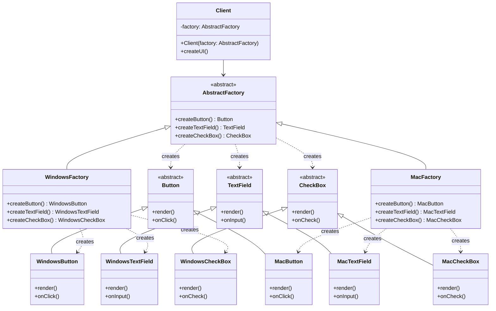

---
tags:
  - 객체지향
  - 디자인패턴
  - GoF
  - 생성패턴
  - 추상팩토리
aliases:
  - Abstract Factory Pattern
  - 추상 팩토리
created: 2025-01-10
title: 추상 팩토리 패턴 개념
note-type: COMMON
difficulty: 중급
time-to-understand: 5분
---

### 추상 팩토리 패턴이란

추상 팩토리 패턴은 **관련된 객체들의 묶음을 생성하는 인터페이스를 제공**하는 생성 패턴이다. 구체적인 클래스를 지정하지 않고도 서로 연관되거나 의존적인 객체들을 생성할 수 있다.

### 핵심 개념

#### 관련 객체 묶음(Product Family)
- 서로 관련된 여러 객체들의 집합
- 예: GUI 컴포넌트 (Button + TextField + CheckBox)
- 각 객체 묶음은 특정 플랫폼이나 스타일을 가진다

#### 주요 구성 요소
- **AbstractFactory**: 객체 묶음 생성을 위한 추상 인터페이스
- **ConcreteFactory**: 특정 객체 묶음을 생성하는 구체적인 팩토리
- **AbstractProduct**: 제품의 추상 인터페이스
- **ConcreteProduct**: 구체적인 제품 구현

### 팩토리 메서드와의 차이점

| 구분 | 팩토리 메서드 | 추상 팩토리 |
|------|---------------|-------------|
| 생성 대상 | **단일 객체** | **관련 객체 묶음** |
| 구조 | 하나의 팩토리 메서드 | 여러 팩토리 메서드 |
| 목적 | 객체 생성 방법 캡슐화 | 관련 객체 묶음 생성 |

### 사용 시기

다음 상황에서 추상 팩토리 패턴을 사용한다:

- **크로스 플랫폼 애플리케이션**: Windows/Mac/Linux용 GUI 컴포넌트
- **테마 시스템**: Light/Dark 테마별 UI 요소들
- **데이터베이스 드라이버**: MySQL/PostgreSQL/Oracle별 연결 객체들

### 장점과 단점

#### 장점
- 관련 객체 묶음 간의 일관성 보장
- 구체적인 클래스와 클라이언트 분리
- 새로운 객체 묶음 추가 용이

#### 단점
- 새로운 객체 타입 추가 시 모든 팩토리 수정 필요
- 코드 복잡도 증가

