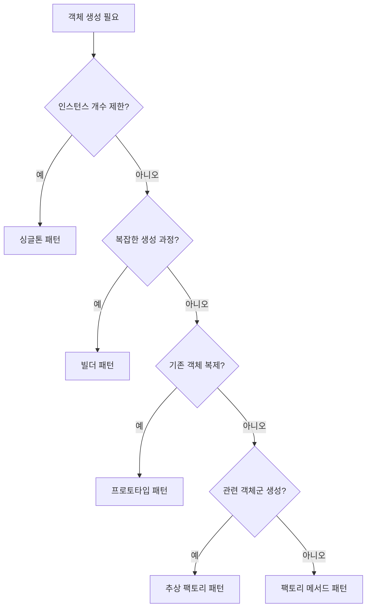

---
tags:
  - 객체지향
  - 디자인패턴
  - GoF
  - 팩토리메서드
  - 생성패턴
  - 비교분석
aliases:
  - Factory Method vs Other Creational Patterns
  - 생성 패턴 비교 분석
created: 2025-06-07
title: 팩토리 메서드 vs 다른 생성 패턴 비교
note-type: COMMON
completed: true
---

## 내용

### 팩토리 메서드 vs 추상 팩토리

팩토리 메서드와 추상 팩토리는 모두 객체 생성을 캡슐화하지만, 생성하는 객체의 범위와 구조에서 차이가 있다.

#### 핵심 차이점

| 구분 | 팩토리 메서드 | 추상 팩토리 |
|------|---------------|-------------|
| **생성 범위** | 단일 제품 타입 | 관련 제품군 |
| **메서드 수** | 하나의 팩토리 메서드 | 여러 개의 팩토리 메서드 |
| **구조** | 상속 기반 | 컴포지션 기반 |
| **확장성** | 새 제품 타입마다 서브클래스 | 새 제품군마다 팩토리 클래스 |

#### 사용 시나리오

**팩토리 메서드를 선택하는 경우:**
- 단일 제품의 다양한 변형이 필요할 때
- 상속 구조가 자연스러운 경우
- 비교적 간단한 객체 생성이 필요할 때

**추상 팩토리를 선택하는 경우:**
- 관련된 여러 객체를 함께 생성해야 할 때
- 플랫폼별 UI 컴포넌트 세트 생성
- 데이터베이스별 DAO 객체군 생성

>[!example] 실무 예시
>**팩토리 메서드**: 로그 레벨별 Logger 생성 (INFO, DEBUG, ERROR)
>**추상 팩토리**: 운영체제별 UI 컴포넌트 생성 (Windows: WinButton + WinCheckbox, Mac: MacButton + MacCheckbox)

### 팩토리 메서드 vs 싱글톤

팩토리 메서드와 싱글톤은 서로 다른 목적을 가진 패턴이지만, 함께 사용되는 경우가 많다.

#### 핵심 차이점

| 구분 | 팩토리 메서드 | 싱글톤 |
|------|---------------|--------|
| **목적** | 객체 생성 방법 캡슐화 | 인스턴스 개수 제한 |
| **생성 객체** | 다양한 타입의 객체 | 자기 자신의 단일 인스턴스 |
| **사용 빈도** | 필요할 때마다 생성 | 애플리케이션당 하나 |
| **메모리 사용** | 매번 새 객체 생성 | 하나의 인스턴스 재사용 |

#### 조합 사용 패턴

팩토리 메서드와 싱글톤은 다음과 같이 조합하여 사용할 수 있다:

1. **팩토리 자체를 싱글톤으로 구현**: 팩토리 인스턴스는 하나만 존재하되, 다양한 제품을 생성
2. **싱글톤 객체를 팩토리 메서드로 생성**: 복잡한 싱글톤 초기화 로직을 팩토리 메서드로 캡슐화

>[!tip] 실무 활용
>**Spring Framework**에서는 Bean Factory가 싱글톤으로 구현되면서 동시에 팩토리 메서드 패턴을 사용하여 다양한 Bean 객체를 생성한다.

### 팩토리 메서드 vs 빌더

팩토리 메서드와 빌더 패턴은 모두 객체 생성을 다루지만, 생성 과정의 복잡성에서 차이가 있다.

#### 핵심 차이점

| 구분 | 팩토리 메서드 | 빌더 패턴 |
|------|---------------|-----------|
| **생성 복잡도** | 단순한 객체 생성 | 복잡한 객체의 단계적 생성 |
| **매개변수** | 적은 수의 매개변수 | 많은 수의 선택적 매개변수 |
| **생성 과정** | 한 번에 생성 | 단계별 구성 후 생성 |
| **가독성** | 간단한 호출 | 메서드 체이닝으로 명확한 의도 |

#### 사용 시나리오

**팩토리 메서드를 선택하는 경우:**
- 객체 생성이 비교적 단순할 때
- 생성할 객체의 타입이 런타임에 결정될 때
- 상속 구조를 활용하고 싶을 때

**빌더 패턴을 선택하는 경우:**
- 많은 선택적 매개변수가 있을 때
- 객체 생성 과정이 복잡할 때
- 불변 객체를 생성하고 싶을 때

>[!example] 코드 비교
>```java
>// 팩토리 메서드
>Document doc = creator.createDocument("report.pdf");
>
>// 빌더 패턴
>Document doc = new DocumentBuilder()
>    .setTitle("Report")
>    .setAuthor("John")
>    .setFormat("PDF")
>    .setEncrypted(true)
>    .build();
>```

### 팩토리 메서드 vs 프로토타입

팩토리 메서드와 프로토타입 패턴은 객체 생성 방식에서 근본적인 차이가 있다.

#### 핵심 차이점

| 구분 | 팩토리 메서드 | 프로토타입 |
|------|---------------|------------|
| **생성 방식** | 새 객체 생성 | 기존 객체 복제 |
| **성능** | 생성 비용 발생 | 복제 비용 (일반적으로 더 빠름) |
| **초기화** | 생성자를 통한 초기화 | 복제 후 필요시 수정 |
| **메모리** | 매번 새로운 메모리 할당 | 기존 객체 상태 복사 |

#### 사용 시나리오

**팩토리 메서드를 선택하는 경우:**
- 객체 생성 비용이 크지 않을 때
- 완전히 새로운 객체가 필요할 때
- 생성 과정에서 다양한 초기화가 필요할 때

**프로토타입을 선택하는 경우:**
- 객체 생성 비용이 클 때 (복잡한 초기화, 네트워크 호출 등)
- 기존 객체와 유사한 객체가 필요할 때
- 런타임에 객체의 클래스가 결정될 때

>[!warning] 주의사항
>프로토타입 패턴 사용 시 **깊은 복사(Deep Copy)**와 **얕은 복사(Shallow Copy)**를 구분해야 한다. 참조 타입 필드가 있는 경우 의도하지 않은 객체 공유가 발생할 수 있다.

### 생성 패턴 선택 가이드라인

실무에서 적절한 생성 패턴을 선택하기 위한 체계적인 가이드라인을 제시한다.

#### 1단계: 생성 목적 파악



#### 2단계: 상황별 선택 기준

| 상황 | 추천 패턴 | 이유 |
|------|-----------|------|
| **단일 객체 타입의 다양한 구현** | 팩토리 메서드 | 상속을 통한 확장성 |
| **관련 객체들의 일관된 생성** | 추상 팩토리 | 제품군의 일관성 보장 |
| **복잡한 객체의 단계적 구성** | 빌더 | 가독성과 유연성 |
| **비용이 큰 객체의 재사용** | 프로토타입 | 성능 최적화 |
| **전역 접근이 필요한 단일 인스턴스** | 싱글톤 | 리소스 관리 |

#### 3단계: 실무 고려사항

**성능 측면:**
- 객체 생성 빈도가 높다면 → 프로토타입 고려
- 메모리 사용량이 중요하다면 → 싱글톤 고려
- 초기화 비용이 크다면 → 지연 초기화 패턴 조합

**유지보수 측면:**
- 새로운 타입 추가가 빈번하다면 → 팩토리 메서드
- 객체 구성이 자주 변경된다면 → 빌더 패턴
- 기존 코드 수정을 최소화하려면 → 추상 팩토리

**팀 역량 측면:**
- 팀의 디자인 패턴 이해도가 낮다면 → 단순한 팩토리 메서드부터 시작
- 복잡한 도메인을 다룬다면 → 추상 팩토리나 빌더 패턴 고려

>[!success] 실무 팁
>**"가장 간단한 해결책부터 시작하라"** - 처음에는 단순한 팩토리 메서드로 시작하고, 요구사항이 복잡해지면 다른 패턴으로 리팩토링하는 것이 좋다.

#### 패턴 조합 활용

실무에서는 여러 생성 패턴을 조합하여 사용하는 경우가 많다:

1. **싱글톤 + 팩토리 메서드**: Spring의 ApplicationContext
2. **추상 팩토리 + 빌더**: GUI 프레임워크의 복잡한 컴포넌트 생성
3. **팩토리 메서드 + 프로토타입**: 게임 엔진의 오브젝트 풀링

>[!note] 관련 학습 자료
>- [[🏛️ 싱글톤 패턴]] - 싱글톤 패턴의 상세한 구현과 활용
>- [[팩토리 메서드 패턴 기본 개념]] - 팩토리 메서드 패턴의 기초 이론
>- [[팩토리 메서드 패턴 실무 적용 사례]] - 실제 프로젝트에서의 활용 사례

## 질문 & 확장

### 심화 학습 질문

1. **패턴 조합**: 어떤 상황에서 여러 생성 패턴을 조합하여 사용하는 것이 효과적인가?
2. **성능 비교**: 각 생성 패턴의 성능 특성은 어떻게 다르며, 어떤 상황에서 성능이 중요한 고려사항이 되는가?
3. **테스트 용이성**: 각 생성 패턴이 단위 테스트 작성에 미치는 영향은 무엇인가?

### 다음 단계 학습

- [[팩토리 메서드 패턴 실무 적용 사례]] - Spring Framework 등에서의 실제 활용
- [[추상 팩토리 패턴]] - 관련 객체군 생성을 위한 패턴
- [[빌더 패턴]] - 복잡한 객체의 단계적 생성 패턴

## 연결 노트

### 상위 개념
- [[🏛️ 팩토리 메서드 패턴]] - 팩토리 메서드 패턴 전체 개요
- [[🏛️ GoF 생성 패턴]] - GoF 생성 패턴 전체 개요

### 관련 개념
- [[팩토리 메서드 패턴 기본 개념]] - 팩토리 메서드 패턴의 기초 이론
- [[팩토리 메서드 패턴 실무 적용 가이드]] - 실무 적용 종합 가이드라인
- [[🏛️ 싱글톤 패턴]] - 비교 대상 패턴 중 하나

### 하위 개념
- [[06. Code Notes/Area/Java/⌨️ 팩토리 메서드 패턴 Java 구현_java (2025-01-07)]] - Java 구현 예제
- 추상 팩토리 패턴과의 구체적 차이점
- 빌더 패턴과의 조합 활용 방법

### 실무 적용 사례
- [[🔬 Spring BeanFactory를 통한 객체 생성 자동화]] - Spring Framework 의존성 주입 자동화
- [[🔬 Java Collections 팩토리 메서드 성능 최적화]] - Collections Framework 메모리 효율성 개선
- [[🔬 파일 처리 시스템 확장성 개선]] - 다양한 파일 형식 지원을 위한 무수정 확장
- [[🔬 환경별 로깅 시스템 동적 설정]] - 개발/운영 환경별 로깅 정책 분리

## 출처

- Gang of Four. "Design Patterns: Elements of Reusable Object-Oriented Software" (1994)
- Joshua Bloch. "Effective Java" 3rd Edition - Item 1: Consider static factory methods
- Martin Fowler. "Patterns of Enterprise Application Architecture" (2002) 