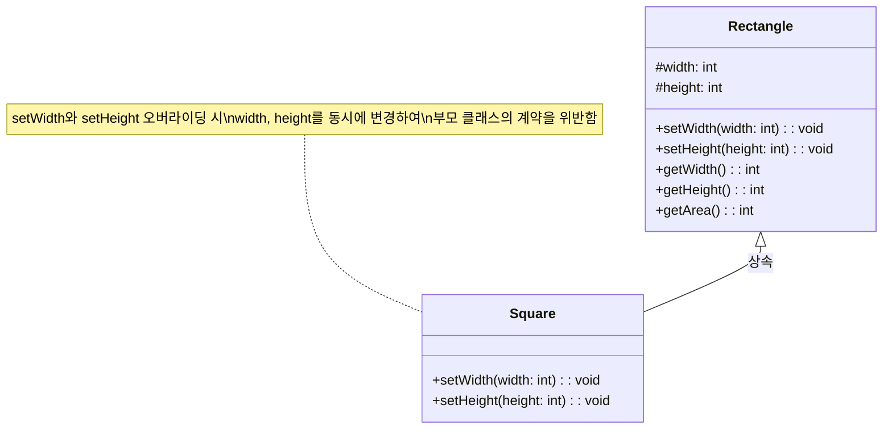
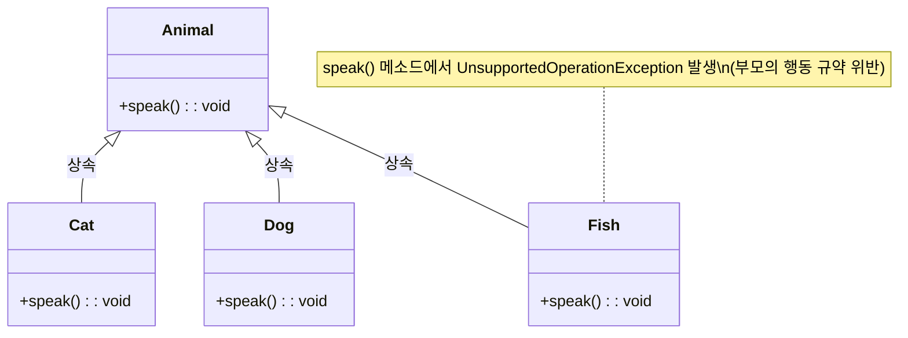
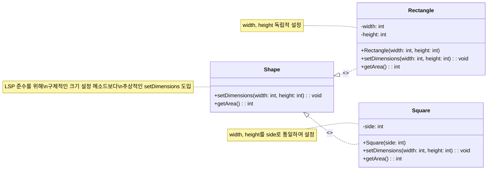

## 정의
리스코프 치환 원칙(LSP)은 객체 지향 프로그래밍의 SOLID 원칙 중 'L'에 해당한다. 이는 서브 타입은 언제나 자신의 기반(부모) 타입으로 교체할 수 있어야 한다는 것을 의미한다. 즉, 부모 클래스의 인스턴스를 사용하는 위치에 자식 클래스의 인스턴스를 대신 사용했을 때 코드가 원래 의도대로 작동해야 한다. 이 원칙은 다형성을 지원하며, 상속 관계에서의 행동 일관성을 강조한다.

## 배경
리스코프 치환 원칙은 1988년 바바라 리스코프(Barbara Liskov)가 올바른 상속 관계의 특징을 정의하기 위해 처음 발표했다. 이 원칙은 단순한 문법적 관계를 넘어, 자료형의 의미론적 상호처리를 보장하기 위한 엄밀한 개념인 '행동적 하위형화'를 제시한다.

## 핵심 개념
리스코프 치환 원칙의 핵심은 '행동적 하위형화'이다. 이는 부모 타입의 객체를 자식 타입의 객체로 교체하더라도, 클라이언트 코드의 동작에 예상치 못한 변화가 없어야 한다는 것을 의미한다. 즉, 자식 클래스는 부모 클래스의 '계약'(contract)을 준수해야 한다.

*   **치환성**: 서브 타입의 객체가 슈퍼 타입의 객체로 완전히 대체 가능해야 한다는 LSP의 기본 전제이다. 이는 프로그램의 정확성을 유지하면서 타입의 유연성을 확보하는 데 중요하다.
*   **다형성**: LSP는 객체 지향 프로그래밍의 다형성 원리를 효과적으로 지원하기 위한 원칙이다. 다형성은 단일 인터페이스로 여러 다른 타입의 객체를 다룰 수 있게 하지만, LSP는 이 다형성이 예상대로 동작하도록 보장한다.
*   **계약에 의한 설계(Design by Contract)와의 관계**: LSP는 메소드 오버라이딩 시 다음과 같은 행동 조건을 강조한다.
    *   **선행 조건(Precondition)**: 하위형에서 강화될 수 없다.
    *   **후행 조건(Postcondition)**: 하위형에서 약화될 수 없다.
    *   **불변 조건(Invariant)**: 하위형에서 상위형의 불변 조건은 반드시 유지되어야 한다.

## 원칙 위반 사례

리스코프 치환 원칙은 부모 클래스의 행동 규약을 자식 클래스가 위반하면 안 된다는 것을 강조한다. 이는 자식 클래스가 오버라이딩을 잘못하거나, 부모 클래스의 의도와 다르게 메소드를 재정의할 때 발생할 수 있다.

### 직사각형-정사각형 예시

LSP 위반의 전형적인 예시는 너비와 높이를 가지는 `Rectangle` 클래스와 이를 상속받는 `Square` 클래스이다. 수학적으로 정사각형은 직사각형의 일종이지만, 객체 지향 상속에서는 문제가 발생할 수 있다.

```java
// LSP를 위반한 직사각형-정사각형 예시

// 직사각형 클래스
public class Rectangle {
    protected int width;
    protected int height;

    public void setWidth(int width) {
        this.width = width;
    }

    public void setHeight(int height) {
        this.height = height;
    }

    public int getWidth() {
        return width;
    }

    public int getHeight() {
        return height;
    }

    public int getArea() {
        return width * height;
    }
}

// 정사각형 클래스 (Rectangle 상속)
public class Square extends Rectangle {
    @Override
    public void setWidth(int width) {
        super.setWidth(width);
        super.setHeight(width); // 높이도 너비와 동일하게 설정
    }

    @Override
    public void setHeight(int height) {
        super.setHeight(height);
        super.setWidth(height); // 너비도 높이와 동일하게 설정
    }
}

// 테스트 코드
public class Main {
    public static void main(String[] args) {
        Rectangle rectangle = new Rectangle();
        rectangle.setHeight(5);
        rectangle.setWidth(10);
        System.out.println("직사각형 넓이: " + rectangle.getArea()); // 기대: 50

        Rectangle square = new Square();
        square.setHeight(5);
        square.setWidth(10); // 여기서 height도 10으로 변경됨
        System.out.println("정사각형 넓이: " + square.getArea()); // 기대: 50, 실제: 100 (마지막 setWidth(10)에 의해 width, height 모두 10이 됨)
    }
}
```

**문제점**: 위 예시에서 `Square` 클래스는 `Rectangle`의 `setWidth`와 `setHeight` 메소드를 오버라이딩하여 정사각형의 특성(너비와 높이가 항상 같음)을 유지하려고 한다. 그러나 `main` 메소드에서 `Rectangle` 타입의 변수 `square`에 `Square` 인스턴스를 할당하고 `setHeight(5)` 후에 `setWidth(10)`을 호출하면, `Rectangle`의 기대와 다르게 `square`의 `height` 또한 `10`으로 변경된다. 이로 인해 `getArea()` 결과가 `50`이 아닌 `100`이 되어 `Rectangle`을 사용하는 클라이언트의 기대(behavioral contract)를 위반한다. 이는 부모 타입으로 교체했을 때 자식 타입의 동작이 예상치 못한 결과를 초래하므로 LSP를 위반하는 사례이다.



>[!warning] 직사각형-정사각형 예시의 LSP 위반
>정사각형(`Square`)이 직사각형(`Rectangle`)을 상속받을 때, `Square`가 `setWidth` 및 `setHeight` 메소드를 오버라이딩하여 너비와 높이를 동시에 변경하면 부모 클래스의 행동 계약을 위반하게 된다. 이는 `Rectangle` 객체로 `Square`를 치환했을 때 예상치 못한 결과(예: 넓이 계산 오류)를 초래한다.

### 메소드 오버라이딩 시 부모의 의도 위반

자식 클래스가 부모 클래스의 의도와 다르게 메소드를 오버라이딩하는 경우도 LSP 위반에 해당한다. 이는 컴파일 시점에는 문제가 없어 보이지만, 런타임 시 예상치 못한 오류를 발생시킬 수 있다.

```java
// 메소드 오버라이딩으로 인한 LSP 위반 예시

// Animal 추상 클래스
abstract class Animal {
    void speak() { /* 기본 동작 */ }
}

// Cat 클래스
class Cat extends Animal {
    @Override
    void speak() {
        System.out.println("냐옹");
    }
}

// Dog 클래스
class Dog extends Animal {
    @Override
    void speak() {
        System.out.println("멍멍");
    }
}

// Fish 클래스 (LSP 위반)
class Fish extends Animal {
    @Override
    void speak() {
        // 물고기는 소리를 내지 못하므로 예외를 던짐 (부모의 행동 규약 위반)
        throw new UnsupportedOperationException("물고기는 말할 수 없음");
    }
}

// 테스트 코드
public class Main {
    public static void main(String[] args) {
        // Animal 타입으로 다양한 동물 객체를 리스트에 추가
        List<Animal> animals = new ArrayList<>();
        animals.add(new Cat());
        animals.add(new Dog());
        animals.add(new Fish());

        for (Animal animal : animals) {
            // 모든 Animal은 speak() 할 수 있을 것으로 기대
            animal.speak(); // Fish 객체에서 UnsupportedOperationException 발생
        }
    }
}
```

**문제점**: `Animal` 클래스는 `speak()` 메소드를 가지고 있으며, `Cat`과 `Dog`는 이를 상속받아 자연스럽게 자신들의 소리를 낸다. 그러나 `Fish` 클래스는 물고기가 소리를 내지 못한다는 이유로 `speak()` 메소드에서 `UnsupportedOperationException`을 던진다. 이로 인해 `Animal` 타입의 리스트를 순회하며 `speak()` 메소드를 호출할 때, `Fish` 객체에서 예외가 발생하여 클라이언트 코드가 `Animal` 타입의 객체는 `speak()`할 수 있을 것이라는 기대를 위반하게 된다. 이는 `Fish` 객체가 `Animal` 객체를 대체할 수 없음을 의미하며, LSP를 위반하는 대표적인 사례이다. 이러한 위반은 협업하는 개발자들 사이의 신뢰를 저하시킬 수도 있다.



>[!warning] 메소드 오버라이딩 시 부모 의도 위반 사례
>자식 클래스(`Fish`)가 부모 클래스(`Animal`)의 메소드(`speak()`)를 오버라이딩하면서 `UnsupportedOperationException`을 던지는 것은, 부모 클래스가 제공하는 계약(모든 `Animal`은 `speak()`할 수 있다)을 위반하는 것이다. 이는 런타임 오류를 발생시켜 LSP를 위반한다.

## 원칙 준수 방안

LSP를 준수하기 위해서는 'IS-A' 관계가 아닌 'IS-SUBSTITUTABLE-FOR' 관계에 초점을 맞춰야 한다. 즉, 자식 클래스가 부모 클래스의 행동을 변경하지 않고 확장할 수 있도록 설계해야 한다. 다음은 LSP를 준수하기 위한 주요 방안이다.

### 올바른 상속 관계 구축

직사각형-정사각형 예시처럼, 개념적으로는 'IS-A' 관계가 성립하더라도 행동적 치환성이 깨지는 경우 상속 관계를 재고해야 한다. 이때는 더 추상적인 상위 개념을 도입하여 계층 구조를 재구성하는 것이 좋다.

```java
// LSP를 준수한 직사각형-정사각형 예시

// Shape 인터페이스 (또는 추상 클래스) 도입
interface Shape {
    void setWidth(int width);
    void setHeight(int height);
    int getWidth();
    int getHeight();
    int getArea();
}

// Rectangle 클래스는 Shape를 구현
class Rectangle implements Shape {
    private int width;
    private int height;

    public Rectangle(int width, int height) {
        this.width = width;
        this.height = height;
    }

    @Override
    public void setWidth(int width) {
        this.width = width;
    }

    @Override
    public void setHeight(int height) {
        this.height = height;
    }

    @Override
    public int getWidth() {
        return width;
    }

    @Override
    public int getHeight() {
        return height;
    }

    @Override
    public int getArea() {
        return width * height;
    }
}

// Square 클래스도 Shape를 구현
class Square implements Shape {
    private int side;

    public Square(int side) {
        this.side = side;
    }

    @Override
    public void setWidth(int width) {
        this.side = width;
    }

    @Override
    public void setHeight(int height) {
        this.side = height;
    }

    @Override
    public int getWidth() {
        return side;
    }

    @Override
    public int getHeight() {
        return side;
    }

    @Override
    public int getArea() {
        return side * side;
    }
}

// 테스트 코드
public class Main {
    public static void main(String[] args) {
        Shape rectangle = new Rectangle(10, 5);
        System.out.println("직사각형 넓이: " + rectangle.getArea()); // 50

        Shape square = new Square(5);
        System.out.println("정사각형 넓이: " + square.getArea());   // 25

        // Shape 타입으로 Rectangle을 사용할 때
        Shape testRect = new Rectangle(10, 5);
        testRect.setWidth(10);
        testRect.setHeight(5);
        System.out.println("테스트 직사각형 넓이: " + testRect.getArea()); // 50

        // Shape 타입으로 Square를 사용할 때
        Shape testSquare = new Square(5);
        testSquare.setWidth(10); // setWidth가 side를 변경
        testSquare.setHeight(5); // setHeight가 side를 변경
        System.out.println("테스트 정사각형 넓이: " + testSquare.getArea()); // 100 (마지막 setWidth(10)에 의해 side가 10이 됨)
    }
}
```

**설명**: 위 예시에서는 `Shape` 인터페이스를 도입하여 `Rectangle`과 `Square`가 각각 `Shape`를 구현하도록 했다. 이렇게 하면 `Rectangle`과 `Square`는 서로 상속 관계를 가지지 않으면서도 `Shape`라는 공통 인터페이스를 통해 다형성을 유지할 수 있다. 하지만 `Square`에서 `setWidth`나 `setHeight`를 호출하면 `side` 값이 변경되어 `Rectangle`과는 다른 동작을 보인다. 완벽하게 LSP를 준수하려면, 애초에 `Shape` 인터페이스가 `setWidth`와 `setHeight`를 포함하지 않거나, `Square`가 이 메소드를 `UnsupportedOperationException`으로 처리하는 대신 `side`를 업데이트하도록 해야 한다. 가장 이상적인 해결책은 사각형의 크기를 변경하는 방식을 추상화하여, `Rectangle`과 `Square`가 각자의 특성에 맞게 구현하도록 하는 것이다. 예를 들어, `setDimensions(int width, int height)`와 같은 추상 메소드를 정의하여, `Rectangle`은 `width`와 `height`를 독립적으로 설정하고, `Square`는 `width`와 `height`를 동일하게 설정하도록 하는 것이다.



### 합성(Composition) 활용

상속보다는 합성을 사용하여 LSP 위반을 방지할 수 있다. 'IS-A' 관계가 불분명하거나 행동적 일관성이 깨질 위험이 있을 때, 객체가 다른 객체를 포함하는 'HAS-A' 관계를 사용하는 것이 더 유연하고 안전하다.

### 계약에 의한 설계(Design by Contract) 엄격히 준수

LSP는 계약에 의한 설계(Design by Contract)의 개념과 밀접하게 연관되어 있다. 하위 클래스는 상위 클래스의 모든 사전 조건(Precondition)을 약화시키지 않고, 사후 조건(Postcondition)을 강화시키지 않으며, 불변 조건(Invariant)을 유지해야 한다. 이는 상속을 통해 파생된 클래스가 클라이언트의 기대를 저버리지 않도록 보장한다.

## 결론 및 중요성

리스코프 치환 원칙(LSP)은 단순히 상속 규칙이 아니라, 객체 지향 시스템의 견고함과 유연성을 보장하는 데 필수적인 원칙이다. 이 원칙을 준수함으로써 얻을 수 있는 이점은 다음과 같다.

*   **코드의 견고성 및 안정성**: LSP를 따르는 코드는 예측 가능한 동작을 하며, 하위 타입이 상위 타입을 대체해도 기존 클라이언트 코드에 영향을 주지 않아 시스템의 안정성이 높아진다.
*   **재사용성 및 확장성**: 상위 타입의 인터페이스를 통해 하위 타입을 다룰 수 있으므로, 새로운 하위 타입이 추가되더라도 기존 코드를 수정할 필요 없이 기능을 확장할 수 있어 코드 재사용성과 확장성이 증대된다.
*   **유지보수성 향상**: 행동적 일관성이 보장되므로, 특정 클래스의 변경이 다른 클래스에 미치는 영향을 최소화하여 유지보수 비용을 줄일 수 있다.
*   **객체 지향 설계의 완성도**: LSP는 다형성의 진정한 의미를 구현하고, 시스템의 설계를 더욱 유연하고 견고하게 만들어 객체 지향 설계의 완성도를 높이는 데 기여한다.

결론적으로, 리스코프 치환 원칙은 단순한 상속 규칙이 아니라, 재사용 가능하고 확장 가능한 고품질 소프트웨어를 개발하기 위한 핵심 원칙이다. 이 원칙을 이해하고 적용함으로써, 개발자들은 더욱 안정적이고 유지보수하기 쉬운 객체 지향 시스템을 구축할 수 있다. 