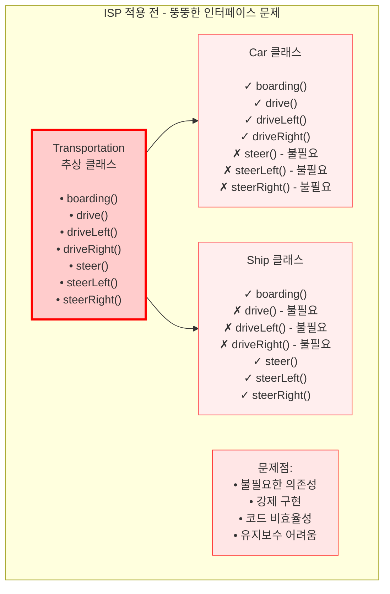
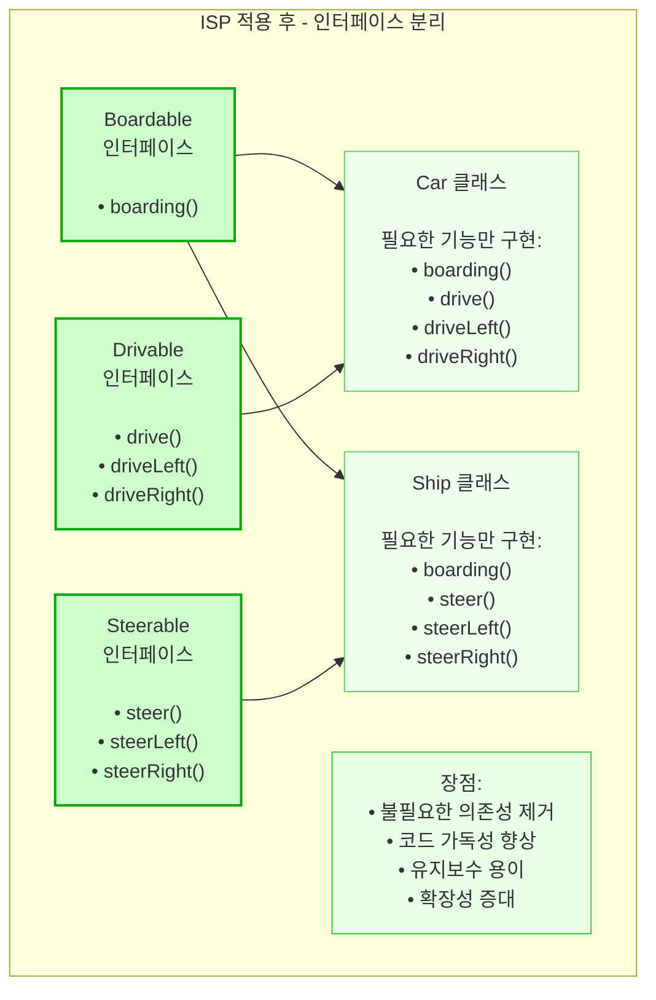

---
tags:
  - Common
  - SOLID
  - 객체지향
  - 디자인패턴
aliases: 
created: 2025-06-04
title: 인터페이스 분리 원칙
note-type: COMMON
completed: true
---

## 정의

인터페이스 분리 원칙(Interface Segregation Principle, ISP)은 SOLID 원칙 중 네 번째 원칙이다. 이 원칙은 클라이언트(사용자)가 자신이 사용하지 않는 메서드에 의존해서는 안 된다고 명시한다. 즉, 인터페이스는 범용적이고 거대하기보다는, 해당 인터페이스를 사용하는 클라이언트의 목적과 용도에 적합하도록 작고 구체적으로 분리되어야 한다.

## 필요성

인터페이스 분리 원칙을 준수하지 않으면 '뚱뚱한(Fat) 인터페이스' 문제가 발생한다. 이는 클래스가 필요하지 않은 메서드에 강제로 구현해야 하는 상황으로 이어진다. 이로 인해 다음과 같은 문제점이 발생한다.

*   **불필요한 의존성**: 클라이언트가 사용하지 않는 메서드에 의존하게 되어, 해당 메서드에 변경이 발생하면 클라이언트 코드도 영향을 받을 수 있다.
*   **코드의 비효율성**: 사용하지 않는 메서드를 빈 내용으로 구현하거나 예외를 발생시키는 등의 불필요한 코드가 늘어난다.
*   **유지보수 및 확장성 저하**: 인터페이스가 변경될 경우, 이를 구현하는 모든 클래스에 영향을 미쳐 유지보수가 어려워지고 새로운 기능을 추가하기가 복잡해진다.

## 위반 사례

### 문제 상황: 뚱뚱한 `Transportation` 추상 클래스

다양한 교통수단의 기능을 포함하는 하나의 거대한 `Transportation` 추상 클래스가 있다고 가정한다. 이 클래스는 자동차와 배의 모든 운전 및 조종 메서드를 포함한다.

```java
// ... 기존 코드 ...

abstract public class Transportation {

    public void boarding() {
        System.out.println("탑승한다.");
    }

    // Car
    public void drive() {
        System.out.println("운전한다.");
    }
    public void driveLeft() {
        System.out.println("왼쪽으로 운전한다.");
    }
    public void driveRight() {
        System.out.println("오른쪽으로 운전한다.");
    }

    // Ship
    public void steer() {
        System.out.println("조종한다.");
    }
    public void steerLeft() {
        System.out.println("왼쪽으로 조종한다.");
    }
    public void steerRight() {
        System.out.println("오른쪽으로 조종한다.");
    }
}

// ... 기존 코드 ...
```

### `Car` 클래스의 불필요한 구현

`Car` 클래스는 `Transportation`을 상속받으므로, 배와 관련된 `steer` 메서드들을 강제로 구현해야 한다. 이는 `Car`에 불필요한 의존성을 부여한다.

```java
// ... 기존 코드 ...

public class Car extends Transportation {

    @Override
    public void boarding() { /* 구현 */ }

    @Override
    public void drive() { /* 구현 */ }
    @Override
    public void driveLeft() { /* 구현 */ }
    @Override
    public void driveRight() { /* 구현 */ }

    @Override
    public void steer() { System.out.println("불필요"); } // 불필요한 구현
    @Override
    public void steerLeft() { System.out.println("불필요"); } // 불필요한 구현
    @Override
    public void steerRight() { System.out.println("불필요"); } // 불필요한 구현
}

// ... 기존 코드 ...
```

## 준수 사례

ISP를 준수하기 위해 `Transportation` 추상 클래스를 클라이언트(여기서는 `Car`와 `Ship`)가 실제로 사용하는 기능에 따라 작고 응집력 있는 여러 인터페이스로 분리한다.

### 분리된 인터페이스

각 기능별로 인터페이스를 분리하여, 각 클래스가 필요한 기능만 선택적으로 구현하도록 한다.

```java
// ... 기존 코드 ...

public interface Boardable {
    void boarding();
}

public interface Drivable {
    void drive();
    void driveLeft();
    void driveRight();
}

public interface Steerable {
    void steer();
    void steerLeft();
    void steerRight();
}

// ... 기존 코드 ...
```

### `Car` 클래스의 선택적 구현

이제 `Car` 클래스는 `Boardable`과 `Drivable` 인터페이스만 구현하여, 자신에게 필요한 기능만 책임진다. `Ship` 클래스도 마찬가지로 `Boardable`과 `Steerable` 인터페이스만 구현하게 된다.

```java
// ... 기존 코드 ...

public class Car implements Boardable, Drivable {

    @Override
    public void boarding() { /* 구현 */ }

    @Override
    public void drive() { System.out.println("운전한다."); }
    @Override
    public void driveLeft() { System.out.println("왼쪽으로 운전한다."); }
    @Override
    public void driveRight() { System.out.println("오른쪽으로 운전한다."); }
}

// ... 기존 코드 ...
```






## SRP(단일 책임 원칙)와의 관계

ISP는 단일 책임 원칙(Single Responsibility Principle, SRP)과 유사하게 보일 수 있지만, 초점이 다르다.

*   **SRP**: 클래스의 단일 책임을 강조한다. 하나의 클래스는 오직 하나의 변경 이유만 가져야 한다.
*   **ISP**: 인터페이스의 단일 책임을 강조한다. 클라이언트가 사용하지 않는 메서드에 의존하지 않도록 인터페이스를 분리하는 데 중점을 둔다.

즉, SRP는 클래스 분리를 통해 이루어지며, ISP는 인터페이스 분리를 통해 이루어진다. 인터페이스는 추상화이므로 여러 역할을 가질 수 있지만, 핵심은 '관련 있는 기능끼리 하나의 인터페이스에 모으되 지나치게 커지지 않도록 크기를 제한'하는 것이다.

## 장점

*   **코드 가독성 향상**: 클라이언트가 필요한 기능만 노출되므로 코드를 이해하기 쉽다.
*   **구현 용이성**: 불필요한 메서드를 구현할 필요가 없어 클래스 구현이 간결해진다.
*   **유지보수 용이성**: 특정 인터페이스의 변경이 해당 인터페이스를 사용하는 클라이언트에게만 영향을 미치므로, 전체 시스템의 파급 효과를 줄인다.
*   **확장성 증대**: 새로운 기능이 추가될 때 기존 인터페이스를 수정하지 않고 새로운 인터페이스를 추가하여 확장할 수 있다.
*   **결합도 감소**: 클래스 간의 불필요한 의존성을 제거하여 시스템의 결합도를 낮춘다.

## 주의점

인터페이스 분리 원칙은 과도하게 적용될 경우 너무 많은 인터페이스가 생겨 코드의 복잡성을 증가시킬 수 있다. 따라서 미래의 확장 가능성과 유지보수성을 고려하여 적절한 균형을 찾는 것이 중요하다. 처음부터 모든 인터페이스를 지나치게 잘게 쪼개기보다는, 기능의 변화가 예상되는 부분을 중심으로 분리하는 것이 바람직하다.

## 연결 노트

- [[🏛️ SOLID 원칙]] - SOLID 원칙 전체 개요
- [[03. Permanent Notes/Single Responsibility Principal|단일 책임 원칙]] - 클래스의 단일 책임 (ISP와 유사하지만 다른 관점)
- [[03. Permanent Notes/Open Closed Principle|개방-폐쇄 원칙]] - 확장에 열려있고 수정에 닫힌 설계
- [[03. Permanent Notes/Liskov Substitution Principle|리스코프 치환 원칙]] - 상속 관계의 올바른 설계
- [[03. Permanent Notes/의존성 역전 원칙|의존성 역전 원칙]] - 추상화에 의존하는 설계 (ISP와 보완적 관계) 