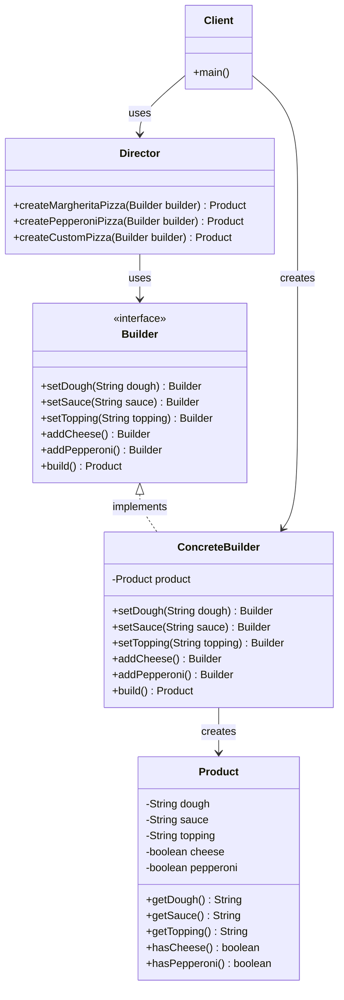

---
tags:
  - design-pattern
  - gof
  - creational-pattern
  - builder
  - structure
aliases: 
created: 2025-01-27
title: 📝 빌더 패턴의 구조
note-type: COMMON
completed: true
difficulty: 입문
time-to-understand: 5분
---

## 빌더 패턴의 구조

빌더 패턴은 4가지 핵심 구성요소로 이루어져 있으며, 각각은 명확한 역할과 책임을 가진다.



### 핵심 구성요소

#### 1. Product (제품)
- **역할**: 생성되는 복잡한 객체
- **특징**: 
  - 여러 부분으로 구성된 복잡한 객체
  - 빌더를 통해 단계적으로 생성됨
  - 최종적으로 클라이언트에게 반환되는 결과물

```java
public class Pizza {
    private String dough;
    private String sauce;
    private String topping;
    private boolean cheese;
    private boolean pepperoni;
    
    // getter 메서드들...
}
```

#### 2. Builder (빌더 인터페이스)
- **역할**: Product 객체의 부분들을 생성하기 위한 추상 인터페이스
- **특징**:
  - 제품을 구성하는 각 부분을 생성하는 메서드를 정의
  - ConcreteBuilder들이 구현해야 할 공통 인터페이스 제공
  - 제품의 내부 표현과 독립적

```java
public interface PizzaBuilder {
    PizzaBuilder setDough(String dough);
    PizzaBuilder setSauce(String sauce);
    PizzaBuilder setTopping(String topping);
    PizzaBuilder addCheese();
    PizzaBuilder addPepperoni();
    Pizza build();
}
```

#### 3. ConcreteBuilder (구체적 빌더)
- **역할**: Builder 인터페이스를 구현하여 실제 제품을 생성하고 조립
- **특징**:
  - Builder 인터페이스의 모든 메서드를 구현
  - 생성 과정에서 제품의 내부 표현을 정의
  - 서로 다른 ConcreteBuilder는 다른 종류의 제품을 생성할 수 있음

```java
public class ItalianPizzaBuilder implements PizzaBuilder {
    private Pizza pizza = new Pizza();
    
    @Override
    public PizzaBuilder setDough(String dough) {
        pizza.setDough(dough);
        return this;
    }
    
    // 다른 메서드들 구현...
}
```

#### 4. Director (감독자)
- **역할**: Builder 인터페이스를 사용하여 객체를 생성하는 순서와 방법을 정의
- **특징**:
  - 복잡한 객체의 생성 알고리즘을 캡슐화
  - 클라이언트로부터 구체적인 빌더 구현을 분리
  - 동일한 생성 과정으로 다른 표현의 객체를 생성 가능

```java
public class PizzaDirector {
    public Pizza createMargheritaPizza(PizzaBuilder builder) {
        return builder
            .setDough("thin")
            .setSauce("tomato")
            .setTopping("basil")
            .addCheese()
            .build();
    }
}
```

### 구성요소 간의 관계

#### 협력 과정
1. **클라이언트**가 Director와 ConcreteBuilder를 생성한다
2. **Director**가 Builder 인터페이스를 통해 제품을 구성한다
3. **ConcreteBuilder**가 각 요청을 처리하고 제품의 부분을 생성한다
4. **클라이언트**가 Builder로부터 최종 Product를 가져온다

#### 의존성 관계
- Director → Builder (인터페이스 의존)
- ConcreteBuilder → Product (생성 관계)
- ConcreteBuilder → Builder (구현 관계)
- Client → Director, ConcreteBuilder (사용 관계)

### 구조의 장점

#### 역할 분리
- 각 구성요소가 명확한 단일 책임을 가진다
- 생성 과정(Director)과 생성 방법(ConcreteBuilder)이 분리된다

#### 확장성
- 새로운 ConcreteBuilder를 추가하여 다른 종류의 제품을 생성할 수 있다
- Director의 생성 알고리즘을 변경하지 않고도 다양한 제품 생성 가능

#### 재사용성
- 동일한 생성 과정을 여러 ConcreteBuilder에서 재사용할 수 있다
- Builder 인터페이스를 통한 일관된 생성 방식 제공

>[!note] 구조 이해 팁
>빌더 패턴의 구조는 "무엇을 만들지(Product)", "어떻게 만들지(Builder)", "실제로 어떻게 구현할지(ConcreteBuilder)", "어떤 순서로 만들지(Director)"를 각각 분리한 것으로 이해할 수 있다. 