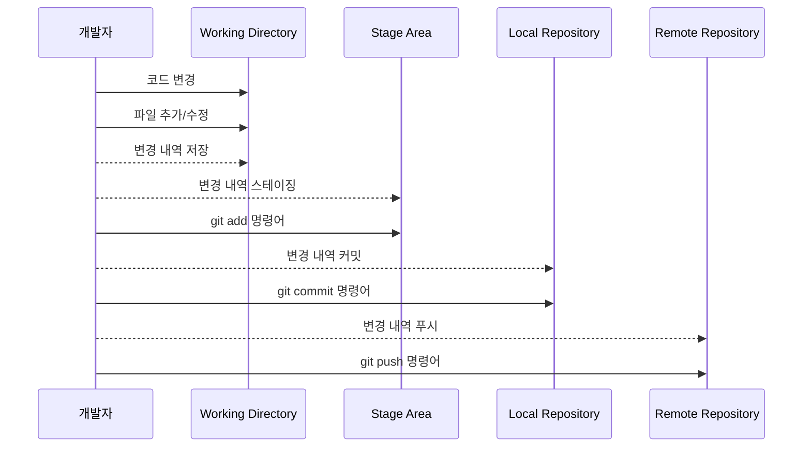

![[Pasted image 20231001224939.png]]

## 소개

Github는 프로그래머와 소프트웨어 개발자들이 소스 코드를 호스팅하고 관리할 수 있는 웹 기반 플랫폼이다.

Git이라는 분산 버전 관리 시스템을 기반으로 하며, Git을 사용하여 소스 코드 변경 내역을 추적하고 관리할 수 있음.

GIthub을 통해 이슈 트래킹, 코드 리뷰, 프로젝트 관리 등 다양한 개발 작업을 효율적으로 수행 가능하다

무료 서버 저장소를 지원하기 때문에 많은 개발자들이 이용한다.  다만 오픈소스를 조건으로 하기 때문에 보안을 중시한다면 Github 보다는 [[GitLab]]을 활용한다고 한다.
## 동작 원리

기본적으로 개발자는 Working Directory에서 코드를 작업하며, 수정된 코드를 Stage Area에 올린다.