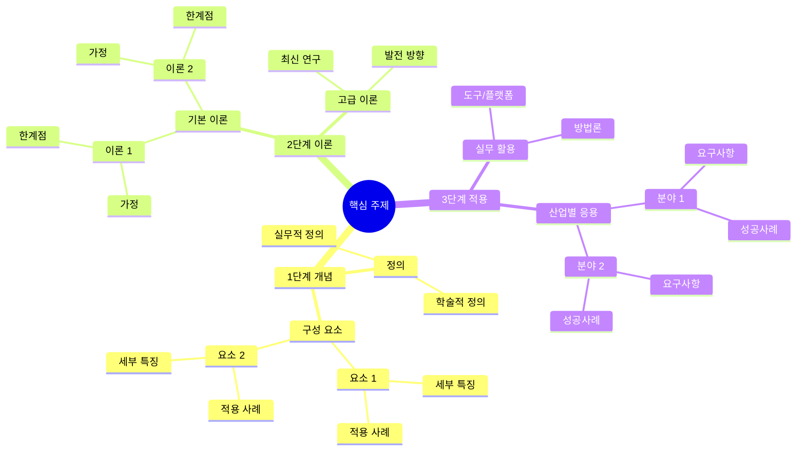
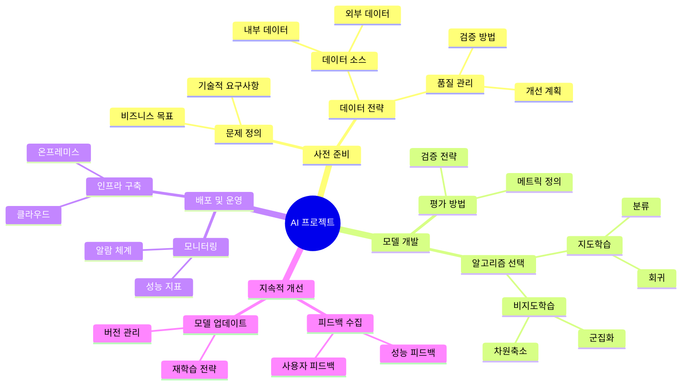

# 계층형 마인드맵 설계 프롬프트

## 입력 형식
```
주제: [핵심 주제]
목적: [학습/연구/프로젝트 기획 등]
원하는 상세도: [상/중/하]
특별히 강조하고 싶은 측면: [이론/실무/응용 등]
```

## 마인드맵 구조 가이드라인

### 1. 핵심 개념 계층화


### 2. 연관 관계 표현 방법
- 수직적 관계: 상위 개념 → 하위 개념
- 수평적 관계: 동일 레벨 개념 간 연관성
- 교차 관계: 서로 다른 브랜치 간 연결점

### 3. 계층별 포함 정보
1. **1단계: 기본 개념**
   - 정의와 용어 설명
   - 핵심 구성 요소
   - 기초 원리
   - 역사적 발전 과정

2. **2단계: 이론적 기반**
   - 기본 이론과 모델
   - 적용 원리
   - 한계점과 제약사항
   - 최신 연구 동향

3. **3단계: 실무 적용**
   - 산업별 활용 사례
   - 구현 방법론
   - 필요 도구와 기술
   - 성공/실패 사례

4. **4단계: 발전 방향**
   - 현재 한계점
   - 연구 동향
   - 미래 전망
   - 잠재적 응용 분야

## 예시 적용: AI/ML 프로젝트 기획


## 작성 지침
1. 각 노드는 명사형 또는 명확한 개념으로 표현
2. 하위 노드로 갈수록 구체적인 내용 포함
3. 실무 적용 가능한 정보는 별도 브랜치로 구성
4. 각 개념 간 연관성을 고려한 구조화
5. 최신 트렌드와 발전 방향 포함
6. 실제 사례와 응용 분야 강조

## 활용 방법
1. 학습 로드맵 설계
2. 프로젝트 범위 정의
3. 연구 주제 구조화
4. 커리큘럼 설계
5. 문서화 및 지식 관리