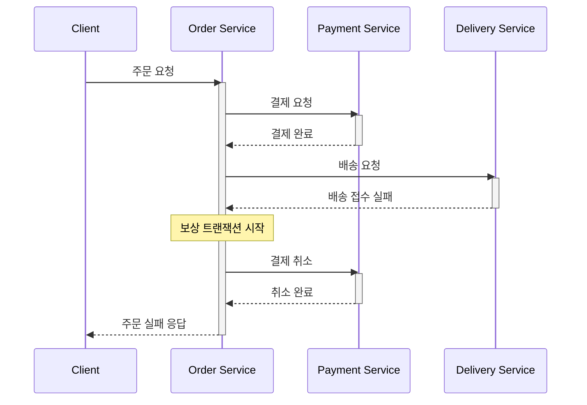

## 내용

### 주제 요약
분산 시스템은 네트워크로 연결된 여러 독립적인 컴퓨터들이 하나의 통합된 시스템처럼 동작하여 사용자에게 단일 시스템처럼 보이도록 설계된 시스템이다[^1]. 이는 높은 가용성, 신뢰성, 성능을 제공하며 현대 클라우드 컴퓨팅의 기반이 된다.

### 핵심 특성

1. **분산성 (Distribution)**
   - 여러 노드가 물리적으로 분리되어 있다.
   - 노드 간 메시지 전달로 통신한다[^2].
   - 각 노드는 독립적으로 동작한다.

2. **투명성 (Transparency)**
   - 위치 투명성: 리소스의 물리적 위치를 숨긴다.
   - 복제 투명성: 데이터 복제를 사용자가 알 필요가 없다.
   - 장애 투명성: 시스템 일부 실패를 감춘다[^3].

3. **확장성 (Scalability)**
   - 수평적 확장: 노드 추가로 용량 증가
   - 수직적 확장: 개별 노드 성능 향상
   - 지리적 확장: 여러 지역에 걸친 분산

### 주요 도전 과제

1. **일관성과 가용성**
   - CAP 정리: 일관성, 가용성, 분할 내성 중 동시에 세 가지를 모두 만족할 수 없다[^4].
   - 예시:
     ```python
     # 최종 일관성 구현 예시
     class DistributedCache:
         def write(self, key, value):
             # 비동기로 다른 노드에 복제
             self.local_write(key, value)
             self.async_replicate(key, value)
     ```

2. **시간과 순서**
   - 물리적 시계 동기화의 어려움
   - 논리적 시계(Lamport 시계) 사용
   - 벡터 시계로 인과성 추적

## 질문 & 확장

1. 분산 시스템에서 발생하는 네트워크 파티션 문제를 어떻게 해결할 수 있는가?
2. 마이크로서비스 아키텍처는 분산 시스템의 원칙을 어떻게 활용하는가?
3. 블록체인은 분산 시스템의 어떤 특성을 활용하며, 어떤 새로운 도전 과제를 제시하는가?
4. 엣지 컴퓨팅이 분산 시스템에 미치는 영향은 무엇인가?

## 출처

[^1]: Tanenbaum, A. S., & Van Steen, M. (2016). "Distributed Systems: Principles and Paradigms"
    > "A distributed system is a collection of independent computers that appears to its users as a single coherent system."
    분산 시스템의 기본 정의와 핵심 개념을 설명하는 권위 있는 교재이다.

[^2]: Coulouris, G., et al. (2011). "Distributed Systems: Concepts and Design"
    > "Message passing is the primary means of communication between processes in a distributed system."
    분산 시스템의 통신 메커니즘과 기본 특성을 설명하는데 활용되었다.

[^3]: Lynch, N. A. (1996). "Distributed Algorithms"
    > "Transparency in distributed systems means hiding the complexity of distribution from users and application programmers."
    시스템의 투명성 개념과 그 중요성을 설명하는데 참조되었다.

[^4]: Brewer, E. (2012). "CAP Twelve Years Later: How the 'Rules' Have Changed"
    > "The CAP theorem asserts that any networked shared-data system can have at most two of three desirable properties."
    분산 시스템의 근본적인 제약사항을 설명하는 핵심 이론을 제공한다.



